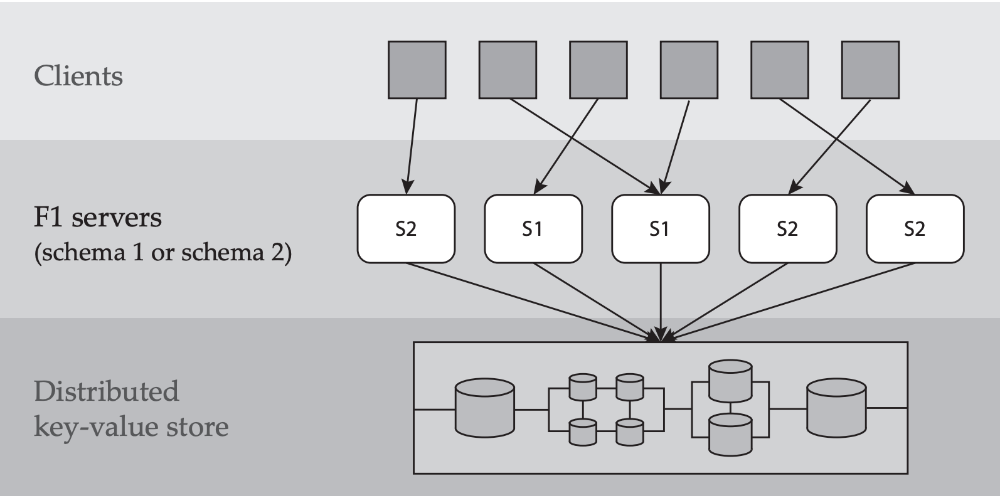
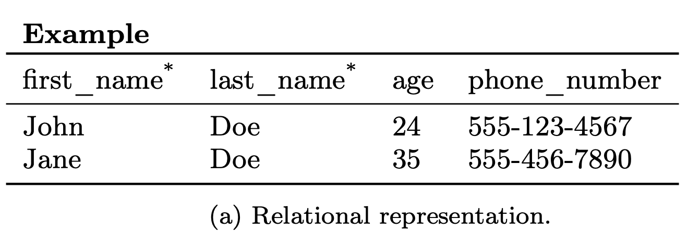
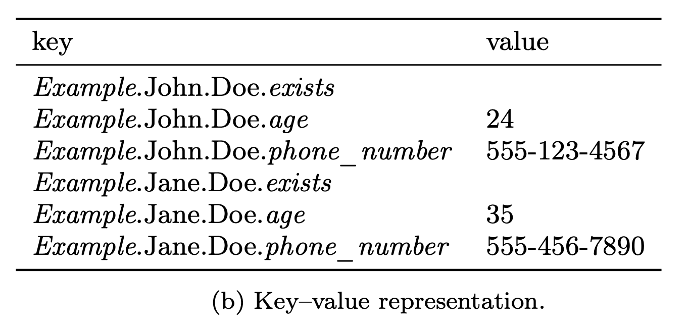

## Abstract

+ a protocol for schema evolution in a globally distributed database management system with **shared data**, **stateless servers**, and **no global membership**.
    + **asynchronous**
    + all servers can **access** and **update** all data during a schema change

## INTRODUCTION

+ Schema evolution:  the ability to change a database’s definition without the loss of data
+ F1 is built on top of Spanner, a globally distributed **KV** data store

### Main feature

The main features of F1 that impact schema changes are:

+ Massively distributed: 
  + An instance of F1 consists of hundreds of individual F1 servers
+ Relational schema: 
  + **Each F1 server has a copy of a relational schema** that describes tables, columns, indexes, and constraints. 
  + Any modification to the schema requires a distributed schema change to update all servers
+ Shared data storage:
  + All F1 servers in all datacenters **have access to all data** stored in Spanner.
+ Stateless servers:
  + F1 servers must tolerate machine failures, preemption(取代), and loss of access to network resources
    + clients may **connect to any F1 server**, even for **different statements in the same transaction**.
+ No global membership:
  + no reliable mechanism for determining currently running F1 servers, and explicit **global synchronization is not possible**

several constraints on the schema change process:

+ Full data availability: 
  + the availability of the data managed by F1 is paramount(至为重要的)
  + it is unacceptable to take even a portion of the database offline during a schema change (e.g., locking a column to build an index).
+ Minimal performance impact:
  + the F1 schema changes rapidly to support new features
+ Asynchronous schema change
  + In other words, different F1 servers may transition to using a new schema at different times

These requirements influenced the design in several ways

+ Since all data must be as available as possible, we do **not restrict access to data undergoing reorganization**.
+ Because the schema change must have minimal impact on user transactions, we allow transactions to **span an arbitrary number of schema changes**, although we do not automatically rewrite queries to conform to the schema in use
+ Applying schema changes asynchronously on individual F1 servers means that **multiple versions of the schema may be in use simultaneously**

### An example

+ Consider a schema change from schema `S1` to schema `S2` that adds index `I` on table `R`
+ Assume two different servers, `M1` and `M2`, execute the following sequence of operations:
  + Server `M2`, using schema `S2`, inserts a new row `r` to table `R`. Because `S2` contains index `I`, server `M2` also adds a new index entry corresponding to `r` to the key– value store.
  + Server `M1`, using schema `S1`, deletes `r`. Because `S1` does not contain `I`, `M1` removes `r` from the key–value store but fails to remove the corresponding index entry in `I`.
+ The second delete **leaves the database corrupt.**

We consider not only changes to the **logical schema**, such as the addition or removal of **columns**, but also changes to the physical schema like adding or removing **secondary indexes**. 

By ensuring that:

+ no more than two schema versions are in use at any given time
+ those schema versions have **specific properties?**

enables distributed schema changes in a way that

> does not require **global membership**, **implicit or explicit synchronization** between nodes, or the need to **retain old schema versions** once a schema change is complete

## BackGround

 In this section, we:

+ separate the **interface provided by the key–value store** from its implementation
+ show how we **map traditional relational database features into this unique setting**

### Key-value store

+ F1 assumes the key–value store supports three operations
  + *put*: insert a value with a given key
  + *del*: delete a value with a given key
  + *get*: returns **any stored values** whose key **matches a given prefix**
  + >  Note that *put* and *del* reference exactly one key–value pair, while *get* may return multiple key–value pairs
+ Two more requirements
    + *Commit timestamps*: Every key–value pair has a **last-modified timestamp** which is updated atomically by the key–value store
    + *Atomic test-and-set support*:  Multiple *get* and *put* operations can be executed **atomically**

### Relational schema

+ An F1 **schema** is a set of table definitions that enable F1 to *interpret the database located in the key–value store*
+ Each table definition has:
  + a list of columns
  + a list of secondary indexes
  + a list of integrity constraints(foreign key or index uniqueness constraints)
  + a list of optimistic locks.
    + required columns that cannot be read directly by client transactions
+  A subset of columns in a table forms the primary key of the table
+ We call a column **required** if its value must be present in every row. All primary-key columns are implicitly required, while non-key columns may be either required or **optional**

### Row representation

+ one pair for each non-primary-key column

+ Each key logically includes
  + the name of the table,
  + the primary key values of the containing row,
  + the name of the column whose value is stored in the pair
+ Although this appears to needlessly repeat all primary key values in the key for each column value, in practice, **F1’s physical storage format eliminates this redundancy**

+ A secondary index
  + covers a **non-empty subset of columns** on a table
  + is itself represented by **a set of key–value pairs** in the key– value store
  + Each row in the indexed table has an associated index key–value pair
    + The key for this pair is formed by concatenating
      + the table name
      + the index name
      + the row’s indexed column values
      + and the row’s primary key values
  + We denote the index key for row $r$ in index $I$ as $k_r(I)$
  + the special exists column doesn't have the associated value
### Relational operations
F1 supports a set of standard relational operations:
+ $insert(R,vk_r,vc_r)$ inserts row *r* to table *R* with primary key values $vk_r$ and non-key column values $vc_r$. Insert fails if a row with the same primary key values already exists in table R.
+ $delete (R, vk_r )$
+ $update(R,vk_r,vc_r)$
+ $query(\vec{R},\vec{C},P)$ :returns a projection $\vec{C}$ of rows from tables in $\vec{R}$ that satisfy predicate $P$ .

