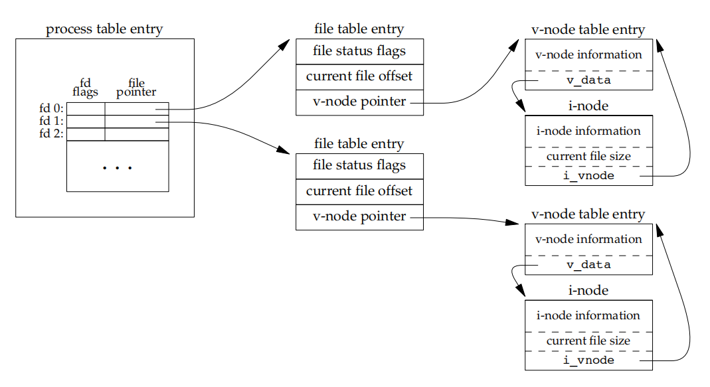
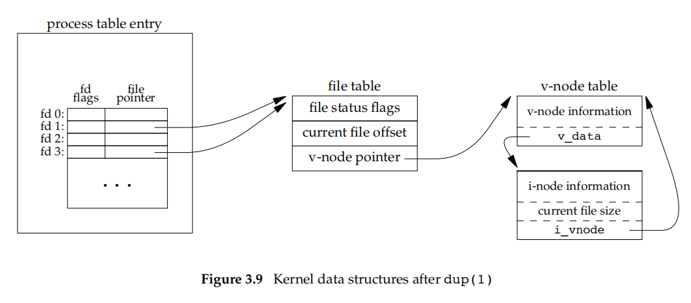

The functions described in this chapter are often referred to as **unbuffered I/O**(which each read or write invokes a system call in the kernel), in contrast to the standard I/O routines

## File Descriptors

1. To the kernel, all open files are referred to by **file descriptors**. A file descriptor is a **non-negative integer.** When we open an existing file or create a new file, the kernel returns a file descriptor to the process. When we want to read or write a file, we identify the file with the file descriptor that was returned by ```open``` or ```creat``` as an argument to either read or write.
2. By convention, UNIX System shells associate file descriptor **0 with the standard input** of a process, file descriptor **1 with the standard output**, and file descriptor **2 with the standard error**
3. File descriptors range from 0 through OPEN_MAX−1

## ```open``` and ```openat```
1.  code
```c
#include <fcntl.h>
int open(const char *path, int oflag, ... /* mode_t mode */ );
int openat(int fd, const char *path, int oflag, ... /* mode_t mode */ );
//Both return: file descriptor if OK, −1 on error
```

2.   This function has a multitude of options, which are specified by the `oflag` argument. This argument is formed by ``ORing`` together one or more of the following constants from the`<fcntl.h>`
header

3. `O_SYNC` Have each write wait for physical I/O to complete, including I/O necessary to update file attributes modified as a result of the write. `O_DSYNC` Have each write wait for physical I/O to complete, but don’t wait for file attributes to be updated if they don’t affect the ability to read the data just written. **The O_DSYNC flag affects a file’s attributes only when they need to be updated to reflect a change in the
file’s data (for example, update the file’s size to reflect more data)**

4.  O_RSYNC Have each read operation on the file descriptor wait until any pending writes for the same portion of the file are complete
  
5.  The fd parameter distinguishes the openat function from the open function. There are three possibilities
    1.  The path parameter specifies an **absolute pathname**. In this case, the fd parameter is **ignored** and the openat function behaves like the open function.
    2.  The path parameter specifies a **relative pathname** and the fd parameter is a **file descriptor** that specifies the starting location in the file system where the relative pathname is to be evaluated. The fd parameter is obtained by opening the directory where the relative pathname is to be evaluated.
    3.  The path parameter specifies a relative pathname and the fd parameter has the **special value AT_FDCWD**. In this case, the pathname is evaluated starting in the current working directory and the openat function behaves like the open function.
6.  `openat` solved two problems
    1.  It gives threads a way to **use relative pathnames to open files** in directories other than the current working directory while all threads in the same process share the same current working directory, so this makes it difficult for multiple threads in the same process to work in different directories at the same time
    2.  it provides a way to avoid **time-of-check-to-time-of-use** (TOCTTOU) errors whose baisc idea is that **a program is vulnerable if it makes two file-based function calls where the second call depends on the results of the first call**. Because the two calls are not atomic, the file can change between the two calls, thereby invalidating the results of the first call, leading to a program error.

## `creat` function

```c
#include <fcntl.h>
int creat(const char *path, mode_t mode);
```
This is equivalent to

```c
open(path, O_WRONLY | O_CREAT | O_TRUNC, mode);
```

## `close` function

```c
#include <unistd.h>
int close(int fd);
```
When a process terminates, all of its open files are closed automatically by the kernel

## `lseek` function
1.  Every open file has an associated ''**current file offset**,’’ normally a non-negative integer that measures the number of bytes from the beginning of the file.Read and write operations normally start at the current file offset and cause the offset to be incremented by the number of bytes read or written An open file’s offset can be set explicitly by calling lseek
    ```c
    #include <unistd.h>
    off_t lseek(int fd, off_t offset, int whence);
    ```
    1.   If `whence` is `SEEK_SET`, the file’s offset is set to offset bytes **from the beginning** of the file
    2.   If `whence` is `SEEK_CUR`, the file’s offset is set to **its current value plus the offset**. The offset can be positive or negative
    3.   If `whence` is `SEEK_END`, the file’s offset is set to the **size of the file plus the offset**. The offset can be positive or negative
2.  Because a successful call to lseek returns the new file offset, we can **seek zero bytes from the current position to determine the current offset**
    ```c
    off_t currpos;
    currpos = lseek(fd, 0, SEEK_CUR);
    ```
    This technique can also be used to determine **if a file is capable of seeking**. If the file descriptor refers to a pipe, FIFO, or socket, lseek sets errno to ESPIPE and returns −1
3.  Normally,a file’s current offset must be a non-negative integer . Because negative offsets are possible, **we should be careful to compare the return value from lseek as being equal to or not equal to −1**, rather than testing whether it is less than 0.
4.  The file’s offset can be greater than the file’s current size, in which case the next  write to the file will extend the file. This is referred to as creating a hole in a file and is  allowed. Any bytes in a file that have not been written are read back as 0. 
5.  **A hole in a file isn’t required to have storage backing it on disk**

## `read` function
```c
#include <unistd.h>
ssize_t read(int fd, void *buf, size_t nbytes);
```
If the read is successful, the number of bytes read is returned. If the end of file is encountered, 0 is returned.
There are several cases in which the number of bytes actually read is less than the
amount requested:
1.  When reading from a regular file, if the end of file is reached before the requested number of bytes has been read.
2.  When reading from a terminal device.
3.  When reading from a network
4.  When reading from a pipe or FIFO.
5.  When reading from a record-oriented device
6.  When interrupted by a signal and a partial amount of data has already been read.
classic definition
```c
int read(int fd, char *buf, unsigned nbytes);
```
difference
1.  `void *` to `char *`
2.  `0` for end-of-file and `-1` for an error

## `write` function
```c
#include <unistd.h>
ssize_t write(int fd, const void *buf, size_t nbytes)
```
The return value is usually equal to the `nbytes` argument; otherwise, an error has occurred. A common cause for a write error is either **filling up a disk or exceeding the file size limit for a given process**

## I/O efficiency
an example
```c
#include "apue.h"
#define BUFFSIZE 4096
int main(void)
{
    int n;
    char buf[BUFFSIZE];
    while ((n = read(STDIN_FILENO, buf, BUFFSIZE)) > 0)
        if (write(STDOUT_FILENO, buf, n) != n)
            err_sys("write error");
    if (n < 0)
        err_sys("read error");
    exit(0);
}
```
some caveats
1.   It reads from standard input and writes to standard output, assuming that these have been set up by the shell before this program is executed
2.   The program doesn’t close the input file or output file.
3.   This example works for both text files and binary file

how we chose the BUFFSIZE value?


## file sharing

The UNIX System supports the sharing of open files among different processes.

The kernel uses three data structures to represent an open file, and the relationships among them determine the effect one process has on another with regard to file sharing

1.  Every process has an entry in the **process table**. Within each process table entry is a table of open file descriptors, which we can think of as a vector, with one entry per descriptor. Associated with each file descriptor are
    1.  The file descriptor flags 
    2.  A pointer to a file table entry
2. The kernel **maintains a file table** for all open files. Each file table entry contains
   1. The file status flags for the file, such as read, write, append, sync, and nonblocking; more on these in Section 3.14
   2. The current file offset
   3. A pointer to the v-node table entry for the file
3. Each open file (or device) has a **v-node structure that contains information about the type of file and pointers to functions that operate on the file**. For most files, the v-node also contains the **`i-node` for the file**. This information is read from disk when the file is opened, so that all the **pertinent information** about the file is readily available. For example, the `i-node` contains the owner of the file, the size of the file, pointers to where the actual data blocks for the file are located on disk, and so on


If two independent processes have the same file open, we could have the arrangement


Each process that opens the file gets its own file table entry, but only a single v-node table entry is required for a given file. One reason each process gets its own file table entry is so that each process has its own current offset for the file.

1.  After each write is complete, the current file offset in the file table entry is incremented by the number of bytes written. If this causes the current file offset to exceed the current file size, the current file size in the i-node table entry is set to the current file offset (for example, the file is extended).
2.  If a file is opened with the `O_APPEND` flag, a corresponding flag is set in the file status flags of the file table entry. Each time a write is performed for a file with this append flag set, the current file offset in the file table entry is first set to the current file size from the i-node table entry. This forces every write to be appended to the current end of file.
3.   If a file is positioned to its current end of file using lseek, all that happens is the current file offset in the file table entry is set to the current file size from the i-node table entry (Note that this is not the same as if the file was opened with the O_APPEND flag)
4.   The lseek function modifies only the current file offset in the file table entry. No I/O takes place


It is possible for more than one file descriptor entry to point to the same file table entry. This also happens after a fork when the parent and the child share the same file table entry for each open descriptor

Note the difference in scope between the file descriptor flags and the file status flags. The former apply only to a single descriptor in a single process, whereas the latter apply to all descriptors in any process that point to the given file table entry

## Atomic Operations

Any operation that requires more than one function call cannot be atomic, as there is always the possibility that the kernel might temporarily suspend the process between the two function calls

```c
#include <unistd.h>
ssize_t pread(int fd, void *buf, size_t nbytes, off_t offset);
//Returns: number of bytes read, 0 if end of file, −1 on error
ssize_t pwrite(int fd, const void *buf, size_t nbytes, off_t offset);
//Returns: number of bytes written if OK, −1 on error
```
If the operation is performed atomically, either all the steps are performed (on success) or none are performed (on failure).

## dup and dup2 Functions

An existing file descriptor is duplicated by either of the following functions

```c
#include <unistd.h>
int dup(int fd);
int dup2(int fd, int fd2);
//Both return: new file descriptor if OK, −1 on error
```
With dup2, we specify the value of the new descriptor with the fd2 argument. If fd2 is already open, it is first closed. If fd equals fd2, then dup2 returns fd2 without closing it. Otherwise, the FD_CLOEXEC file descriptor flag is cleared for fd2, so that fd2 is left open if the process calls exec



## `sync`,`fsync` , and `fdatasync` function

Traditional implementations of the UNIX System have a buffer cache or page cache in the kernel through which most disk I/O passes. When we write data to a file, the data is normally copied by the kernel into one of its buffers and queued for writing to disk at some later time. This is called delayed write

To ensure consistency of the file system on disk with the contents of the buffer cache, the sync, fsync, and fdatasync functions are provided.

```c
#include <unistd.h>
int fsync(int fd);
int fdatasync(int fd);
    //Returns: 0 if OK, −1 on error
void sync(void);
```

The `sync` function simply **queues all the modified block buffers for writing and returns**; it does not wait for the disk writes to take place.The function sync is normally **called periodically** (usually every 30 seconds) from a system daemon, often called update.

The function `fsync` refers only to a single file, specified by the file descriptor fd, and waits for the disk writes to complete before returning.(database)

The fdatasync function is similar to fsync, but it affects only the data portions of a file. With fsync, the file’s attributes are also updated synchronously

## `fcntl` function

```c
#include <fcntl.h>
int fcntl(int fd, int cmd, ... /* int arg */ );
//Returns: depends on cmd if OK (see following), −1 on error
```

The fcntl function is used for five different purposes
1. Duplicate an existing descriptor (cmd = F_DUPFD or F_DUPFD_CLOEXEC)
2. Get/set file descriptor flags (cmd = F_GETFD or F_SETFD)
3. Get/set file status flags (cmd = F_GETFL or F_SETFL)
4. Get/set asynchronous I/O ownership (cmd = F_GETOWN or F_SETOWN)
5. Get/set record locks (cmd = F_GETLK, F_SETLK, or F_SETLKW)

## `ioctl` function

The `ioctl` function has always been the catchall for I/O operations. Terminal I/O was the biggest user of this function

```c
#include <unistd.h> /* System V */
#include <sys/ioctl.h> /* BSD and Linux */
int ioctl(int fd, int request, ...);
//Returns: −1 on error, something else if OK
```

Normally, additional device-specific headers are required. For example, the `ioctl` commands for terminal I/O, beyond the basic operations specified by POSIX.1, all require the  header.


Each device driver can define its own set of `ioctl` commands. The system, however, provides generic `ioctl` commands for different classes of devices

## `/dev/fd`

Newer systems provide a directory named `/dev/fd` whose entries are files named 0, 1, 2, and so on

In the function call 

```c
fd = open("/dev/fd/0", mode); 
```

most systems ignore the specified mode, whereas others require that it be a **subset** of the mode used when the **referenced file** (standard input, in this case) was originally opened. Because the previous open is equivalent to 

```c
fd = dup(0); 
```

the descriptors 0 and `fd` share the same file table entry

For example, if descriptor 0 was opened read-only, we can only read on `fd`. Even if the system ignores the open mode and the call succeeds, we still can’t write to `fd`.

The **main use** of the `/dev/fd` files is from the shell. It allows programs that use pathname arguments to **handle standard input and standard output in the same manner as other pathnames**, like `cat -` to `cat /dev/fd/0`

The special meaning of `-` as a command-line argument to refer to the standard input or the standard output is a kludge that has crept into many programs. There are also problems if we specify - as the first file, as it looks like the start of another command-line option. Using `/dev/fd` is a step toward uniformity and cleanliness.