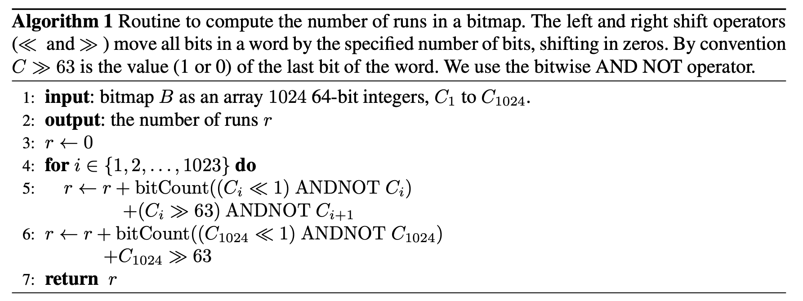

## 0x0 Introduction

A bitmap, also known as a bit array or bitset, is a data structure that represents a fixed-size sequence of bits.  That is the value of the _ith_ bit representing the existence of the the _ith object._
Bare bitmap can cost much memory according to the total substantial data size, even if we have stored little infomation. Roaring bitmap provide a new method to compress the bitmap structure.

## 0x1 Related Infomation:

-  blogs:
   - (Very Important Introduction) [[Blog of Vikram Oberoi]:A primer on Roaring bitmaps: what they are and how they work](https://www.vikramoberoi.com/a-primer-on-roaring-bitmaps-what-they-are-and-how-they-work/?utm_source=blog.quastor.org&utm_medium=referral&utm_campaign=how-grab-implemented-rate-limiting)
   - [[blog of charlieroro] roaring bitmaps](https://www.cnblogs.com/charlieroro/p/17919505.html)
   - [【木东居士】：不深入而浅出 Roaring Bitmaps 的基本原理](https://cloud.tencent.com/developer/article/1136054)
-  paper 
   - Introduction: [Better bitmap performance with Roaring bitmaps.pdf](Better%20bitmap%20performance%20with%20Roaring%20bitmaps.pdf)
   - Opitmazition: [Consistently faster and smaller compressed bitmaps with Roaring.pdf](Consistently%20faster%20and%20smaller%20compressed%20bitmaps%20with%20Roaring.pdf)

## 0x2 Introduction TO Roaring Bitmap

### 0x21 two types of containers

We partition the range of 32-bit indexes ([0, n)) into chunks of $2^{16}$ integers sharing the same 16 most significant digits. We use specialized containers to store their 16 least significant bits.

(One chunk' size is up to 8KB, that is 4096 integers.)

When a chunk contains no more than 4096 integers, we use a sorted array of packed 16-bit integers. When there are more than 4096 integers, we use a $2^{16}$​-bit bitmap. Thus, we have two types of containers: an array container for sparse chunks and a bitmap container for dense chunks.

**Since the size of a chunk is up to 8KB, we may save much memoy if the cardinality is small. Don't worry about the memory allocator, it can deal with the small memory with local buffer. And I believe it's the most important meaning of two types of containers.**


### 0x22 conversion between the two types of container

**timing**

- When removing an integer, a bitmap container might become an array container if its cardinality reaches 4096.
- When adding an integer, an array container might become a bitmap container when its cardinality exceeds 4096.

---

**method**

- When this happens, a new container is created with the updated data while the old container is discarded.
- Converting an array container to a bitmap container is done by creating a new bitmap container initialized with zeros, and setting the corresponding bits.
- To convert a bitmap container to an array container, we extract the location of the set bits using an optimized algorithm


### 0x23 index array

To check for the presence of a 32-bit integer x, we first seek the container corresponding to $x/2^{16}$ using binary search. If a bitmap container is found, we access the (x mod $2^{16}$)th bit. If an array container is found, we use a binary search again

> The containers are stored in a dynamic array with the shared 16 most-significant bits: this serves as a first-level index. The array keeps the containers sorted by the 16 most-significant bits.


## 0x3 set operations

There are 

- Two basic opertions: union (bitwise OR) and intersection (bitwise AND); 
- And three container type combinations: bitmap vs bitmap, array vs array annd bitmap vs array

### 0x31 bitmap vs bitmap

**union operation**(**the result must be a bitmap container**) **:**


It might seem like computing bitwise ORs and computing the cardinality of the result

would be significantly slower than merely computing the bitwise ORs. However, four factors mitigate this potential problem

1. **[built in cpu instructions]**: popular processors (Intel, AMD, ARM) have fast instructions to compute the number of ones in a word. Intel and AMD’s _popcnt_ instruction has a throughput as high as one
   operation per CPU cycle.
2. **[Java Opitimization]**: Recent Java implementations translate a call to Long.bitCount into such fast
   instructions.
3. **[superscalar]:** Popular processors are superscalar: they can execute several operations at once. Thus, while we retrieve the next data elements, compute their bitwise OR and store it in memory, the processor can apply the popcnt instruction on the last result and increment the cardinality counter accordingly.
4. **[enough L1 cache]**: For inexpensive data processing operations, the processor may not run at full capacity due to cache misses.

---

**intersection operation:**

For computing intersections, we use a less direct route. First, we compute the cardinality of the result, using 1024 bitwise AND instructions. If the cardinality is larger than 4096, then we proceed as with the union, writing the result of bitwise ANDs to a new bitmap container. Otherwise, we create a new array container. We extract the set bits from the bitwise ANDs on the fly. See chapter "0x22" for detail

### 0x32 bitmap vs array

- intersection(**the result must be an array container**)：we iterate over the sorted dynamic array, and verify the existence of each 16-bit integer in the bitmap container. The result is written out to an array container
- Unions(**the result must be a bit map container**)：we create a copy of the bitmap and simply iterate over the array, setting the corresponding bits

### 0x33 Array vs Array

-  For unions: 
   - if the sum of the cardinalities is no more than 4096(**the result must be an array container**): we use a merge algorithm between the two arrays
   - otherwise: Otherwise, we set the bits corresponding to both arrays in a bitmap container. We then compute the cardinality using fast instructions. If the cardinality is no more than 4096, we convert the bitmap container to an array containe.
-  intersection(**the result must be an array container**): 
   - if the two arrays have cardinalities that differ by less than a factor of 64: merge
   - otherwise: galloping intersection

---

**Galloping** is superior to a simple merge when one array ($r$) is much smaller than other one ($f$) because it can skip many comparisons. Starting from the beginning of both arrays, we pick the next available integer $r_i$ from the small array $r$ and seek an integer at least as large $f_j$ in the large array $f$ , looking first at the next value, then looking at a value twice as far, and so on. Then, we use binary search to advance in the second list to the first value larger or equal to $r_i$ .

[Galloping(exponential search) Introduction](https://en.wikipedia.org/wiki/Exponential_search)

The initial value of `bound` can alway advance in each search.

```cpp
// Returns the position of key in the array arr of length size.
template <typename T>
int exponential_search(T arr[], int size, T key)
{
    if (size == 0) {
        return NOT_FOUND;
    }

    int bound = 1;
    while (bound < size && arr[bound] < key) {
        bound *= 2;
    }

    return binary_search(arr, key, bound/2, min(bound + 1, size));
}
```

### 0x34 in place operations

- When computing the union between two bitmap containers, we can modify one of the two bitmap containers instead of generating a new bitmap container. Similarly, for the intersection between two bitmap containers, we can modify one of the two containers if the cardinality of the result exceeds 4096
- When computing the union between an array and a bitmap container, we can write the result to the bitmap container, by iterating over the values of the array container and setting the corresponding bits in the bitmap container. We can update the cardinality each time by checking whether the word value has been modified.

## 0x4 The "run" type container

### 0x41  To introduction to "run"

The original Roaring has a limitation in some scenarios because it does not compress long runs of values. Indeed, given a bitset made of a few long runs (e.g., all integers in [10, 1000]), Roaring—as presented so far—can only offer suboptimal compression. If we consider the case of a bitmap made of all integers in [10, 1000], Roaring without support for runs would use 8 kB, whereas a few bytes ought to suffice.

1. Such unnecessarily large bitmaps can stress memory bandwidth.
2. computing the intersection of two bitmaps representing the ranges [10, 1000] and [500, 10000] can be done in a few cycles when using RLE-compressed bitmaps. But the original Roaring would require intersecting two bitmap containers and possibly thousands of cycles. See chapter "0xF1" for detail.

---

To solve this problem, we decided to add a third type of container to Roaring, one that is ideally suited to coding data made of runs of consecutive values. The new container is _conceptually_ simple: **given a run (e.g., [10, 1000]), we store the starting point (10) and its length minus one (990). By packing the starting points and the lengths in pairs, using 16 bits each, **we preserve the ability to support fast random access by binary search through the coded runs

The run container, **is made of a packed array of pairs of 16-bit integers**. The first value of each pair represents a starting value, whereas the second value is the length of a run. For example, we would store the values 11, 12, 13, 14, 15 as the pair 11, 4 where 4 means that beyond 11 itself, there are 4 contiguous values that follow. 

In addition to this packed array, we need to **maintain the number of runs** stored in the packed array. Like the array container, the run container is stored in a dynamic array. During serialization, we **write out the number of runs**, followed by the corresponding packed array.

### 0x42 Decide The Best Container

To decide the best container type, **we are motivated to minimize storage**. In serialized form, a run container uses 2 + 4r bytes(16-bit integer is 2 bytes and we need a pair; plus the number of runs) given r runs, a bitmap container always uses 8192 bytes and an array container uses 2c + 2 bytes, where c is the cardinality. Therefore, we apply the following rules:

- All array containers are such that they use no more space than they would as a bitmap container: they contain no more than 4096 values.
- Bitmap containers use less space than they would as array containers: they contain more than 4096 values.
- A run container is only allowed to exist if it is smaller than either the array container or the bitmap container that could equivalently store the same values. 
  - If the run container has cardinality greater than 4096 values, then the number of runs must be no more than $\lceil(8192 − 2)/4\rceil = 2047$  runs. (Or it must be converted to a bitmap container)
  - If the run container has cardinality no more than 4096, then the number of runs must be less than **half the cardinality**. (Or it must be converted to an array container)

**So, the critical step in deciding whether an array or bitmap container should be converted to a run container is to count the number of runs of consecutive numbers it contains. **

### 0x43 Compute The Number Of Runs

For array containers, we count this number by iterating through the 16-bit integers and comparing them two by two in a straightforward manner. Because array containers have at most 4096 integers, this computation is expected to be fast.

---

For bitmap containers, the below algorithm shows how to compute the number of runs. 



We can illustrate the core operation of the algorithm using a single 32-bit word containing 6 runs of consecutive ones:


- We can verify that $\mathrm{bitCount}((C_i \ll 1)\ \mathrm{ANDNOT}\ C_i) = 6$, that is, we have effectively computed the number of runs.  ($a\ \mathrm{ANDNOT}\ b$is true iff a=1 and b=0)
- In the case where a run continues up to the left-most bit, and does not continue in the next word, it does not get counted, but we add another term (($C_i \gg 63$) ANDNOT $C_i+1$ when using 64-bit words) to check for this case.

Nevertheless, the computation may be expensive—exceeding the cost of computing the union or intersection between two bitmap containers. Thus, instead of always computing the number of runs exactly, we rely on the observation that no bitmap container with more than 2047 runs should be converted. As soon as we can produce a lower bound exceeding 2047 on the number of runs, we can stop. An exact computation of the number of runs is important only when our lower bound is less than 2048. **In short: estimate the lower bound count of runs first, and only do the precise computation if the lower bound is less than 2048.**

There are several method to implement the heuristic algorithm, and see the paper for details.


### 0x44 Logical operations

There are many necessary logical operations, but we present primarily the **union** and **intersection**.

#### 0x441 Bitmap vs Bitmap:

## 0xF appendix

### 0xF1 RLE-based compressed bitmaps

There are many RLE-based compression formats. 

#### 0xF11 Introduction To WAH

For example, **WAH** organizes the data in _literal_ and _fill_ words. 

- Literal words contain a mix of W − 1 zeros and ones (e.g., $01011 · · · 01$) where W denotes the word size in bits: typically W = 32 or W = 64. 
- Fill words are made of just W − 1 ones or just W − 1 zeros (i.e., $11 · · · 11$ or $00 · · · 00$). WAH compresses sequences of consecutive identical fill words

The most significant bit of each word distinguishes between fill and literal words

- When it is set to one, the remaining W −1 bits store the W −1 bits of a literal word.
- When it is set to zero, the second most significant bit indicates the bit value whereas the remaining bits are used to store the number of consecutive identical fill words (the run length)

#### 0xF12 Introduction To Concise

**Concise** is a variation that reduces the memory usage when the bitmap is _moderately sparse. _Instead of storing the run length using $W − 2$ bits, Concise uses only $W − 2 − \lceil log2(W )\rceil$ bits to indicate a run length $r$, reserving $\lceil log2(W )\rceil$ bits to store a value $p$. When $p$ is non-zero, we decode $r$ fill words, plus a single $W − 1$ bit word with its $p^{th}$ bit flipped.

Below is an example:


