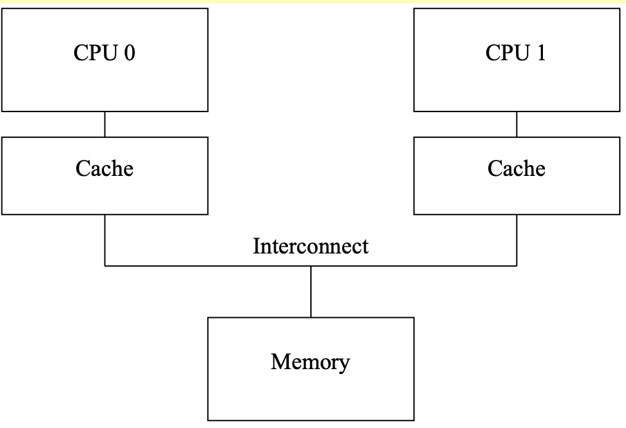

-  paper 
   - Introduction: [Memory Barriers: a Hardware View for Software Hackers](https://raw.githubusercontent.com/mobilephone724/blog_pictures/master/memory_barrier_withMarginNotes.2024_06_16_1718472482.pdf)

## 0x0 why we need memory barrier

In short, because **reordering memory references allows much better performance**, and so memory barriers are needed to force ordering in things like synchronization primitives whose **correct operation depends on ordered memory references**.

## 0x1 **Cache Structure**



### 0x11 some cases of cache miss(not important)

The cache miss means that the CPU will have to wait (or be “stalled”) for hundreds of cycles while the item is fetched from memory.

- **capacity miss**: After some time, the CPU’s cache will fill, and sub- sequent misses will likely need to eject an item from the cache in order to make room for the newly fetched item
- **associativity miss**: occur in set-associative caches.
  
    > An "associativity cache miss" refers to a specific type of cache miss that can occur in set-associative caches.
    > 
    
    > In a set-associative cache, the cache memory is divided into sets, and each set contains multiple cache lines (or cache blocks). When the CPU needs to access data in memory, it first checks the cache to see if the data is present. The cache lookup is done by first identifying the set that the data would be stored in, and then searching through the multiple cache lines within that set to see if the data is present.
    > 
    
    > An associativity cache miss occurs when the data the CPU needs is not found in any of the cache lines within the identified set. This means the CPU has to go to main memory to fetch the data, which is slower than finding it in the cache.
    > 
    
    > The number of cache lines per set is called the "associativity" of the cache. Caches with higher associativity (more cache lines per set) generally have lower associativity cache miss rates, but they are also more complex and expensive to implement. The goal is to find the right balance of associativity to minimize cache misses without making the cache design overly complex.
    > 
- **write miss**: Before a given CPU writes to that data item, it must first cause it to be removed, or “invalidated”, from other CPUs’ caches. Once this invalidation has completed, the CPU may safely modify the data item. If the data item was present in this CPU’s cache, but was read- only, this process is termed a “write miss”.

cache structure: one cache address can store two(or more?) sets of data.


## 0x2 Cache-Coherence Protocols

### 0x21 Four state: MESI States

The four types of states represent the state of a cache line in one cpu.

Here, we use “I” to represent the cpu.

- **modified**:
    - I have changed the value in private cache and not written it back to memory.
    - Others  can’t access the memory until change their states(signal me).
- **exclusive**:
    - I haven’t changed the value in private cache. (But may change it later, transfer to **modified** state)
    - Others can’t access the memory until change their states(signal me).
- **shared**
    - Others can read the memory without consulting me.
- **invalid:**
    - the cache line holds no data.

### 0x22 Messages between the cpus(and memory): MESI Protocol Messages

- **Read:** a request for reading  a line
- **Read Response**: The line data for a previous read. Either of memory or other cpu.
- **Invalidate**: invalidate the line in **all other cpus**
- **Invalidate Acknowledge:** successful response to a previous **Invalidate** message
- **Read Invalidate**: a **atomic combination** of “read” and “invalidate”. Requires both a “read response” and a set of “in- validate acknowledge” messages in reply.
- **Writeback:** write a line to memory

### 0x23 State Machine: MESI State Diagram


Transitions are explained below:

- (a): write back to memory
- (b): modify the data in cache
- (c): I haven’t written back to memory but another cpu requests it (and will change it). So I return the value in cache and invalidate the private one without writing back to memory
- (d): I want to change a cache, so I emit a “invalidate” to other cpus. Now all others have acknowledge me, so I read and change my private cache.
- (e): Similar to “(d)”, but don’t need to read in memory.
- (f): Similar to (c), I haven’t written back to memory but another cpu requests it (but will not change it), so I return my private value.
- (g): Similar to (f)
- (h): similar to “(d)”, but don’t modify it now
- (i): similar to “(c)”, but don’t need to return my private value since that in memory is still the newest.
- (j): Similar to “(d)”
- (k): read in memory( or other cpu)
- (l): receive a “invalidate” message

Examples are in the paper.

## 0x3 Optimize 1: Stores Result in Unnecessary Stalls

Consider to modify a cache that isn’t in **modified** or **exclusive** state.


- **Problem**: there is no real reason to force CPU 0 to stall for so long — after all, regardless of what data happens to be in the cache line that CPU 1 sends it, CPU 0 is going to unconditionally overwrite it.
- **Solution**: Add “store buffers” between each CPU and its cache
    - CPU0 write to its store buffer immediately
    - **When CPU0 is acknowledged, the data will be moved from the store buffer to the cache line**

### 0x31: Store Forwarding problem


Thinking of the program below:

- CPU0 has value b
- CPU1 has value a = 0 in exclusive mode

```
a = 1;
b = a + 1;
assert(b == 2);
```

step1: cpu0 invalidate cpu1 with “a” , change private cache line to 1, and write it to store buffer.

step2: cpu0 receive the value “a” from cpu1. The value is 0, and it’s stored in private cache.(Note that the value in the store buffer is 1)

step3: cpu0 executes “b = a + 1”, load “a” from cache, and its value is 0

step4: cpu0 store the value of “b” to cache, whose value is 1

step5: cpu0 move the value of “a” from store buffer(1) to cache(0)

step6: CPU0 executes assert(b==2), which fails.

The problem is that we have two copies of “a”, one in the cache and the other in the store buffer.

---

The hardware guys took pity and implemented “store forwarding”, where **each CPU refers to (or “snoops”) its store buffer as well as its cache when performing loads**

**In other words, a given CPU’s stores are directly forwarded to its subsequent loads, without hav- ing to pass through the cache.**


### 0x32 Store Buffers and Memory Barriers

Think of the program below

```
void foo(void)
{
  a=1;
  b=1;
}

void bar(void) {
  while (b == 0) continue;
  assert(a == 1);
}
```

- cpu0 executes foo
    - own “b”
- cpu1 executes bar
    - own “a”

---


The problem is that, cpu1 reads “a” before being acknowledged that other cpus have changed it. Although CPU0 can continue to execute before writing it to stored buffer, but CPU1 doesn’t know that.

The hardware designers cannot help directly here, since the **CPUs have no idea which variables are related, let alone how they might be related**

Therefore, the hardware designers provide **memory-barrier** instructions to allow the software to tell the CPU about such relations. The program fragment must be updated to contain the memory barrier:

```
void foo(void)
{
  a=1;
  smp_mb();
  b=1;
}

void bar(void)
{
  while (b == 0) continue;
  assert(a == 1);
}
```

The memory barrier `smp_mb()` will cause the CPU to flush its store buffer before applying subsequent stores to their cache lines. The CPU could either 

- simply stall until the store buffer was empty before proceeding, or
- it could only use the store buffer to hold subsequent stores until all of the prior entries in the store buffer had been applied.
    - This is to prevent other cpus from getting the subsequent value before getting the prior entries

So that, CPU0 will

- wait for the “invalidate acknowledge” message of “a” before executing “b=1;”

or 

- (1)while executing `smp_mb` ,marks all current store-buffer entries (namely, the a=1)
- (2) while executing “b=1”, only stores it store buffer.
- (3) wait “invalidate acknowledge” of “a”
- (4) store the value of b in stored buffer and send a “invalidate” message

## 0x4 Optimize 2: Store Sequences Result in Unnecessary Stalls

1. Once the stored buffer is full or a memory barrier is encountered, the CPU must once again wait for invalidations to complete in order to drain its store buffer before it can continue executing
2. invalidate acknowledge messages can take so long: they must ensure that the corre- sponding cache line is actually invalidated, and this invalidation can be delayed if the cache is busy, for example, if the CPU is intensively loading and storing data, all of which resides in the cache.

However, the CPU need not actually invalidate the cache line before sending the acknowledgement.

### 0x42 Invalidate Queues and Invalidate Acknowledge


**A CPU with an invalidate queue may acknowledge an invalidate message as soon as it is placed in the queue, instead of having to wait until the corresponding line is actually invalidated.**

### 0x43 Invalidate Queues and Memory Barriers

Thinking of the following code:

```
void foo(void)
{
  a=1;
  smp_mb();
  b=1;
}

void bar(void)
{
  while (b == 0) continue;
  assert(a == 1);
}
```

- CPU0:
    - execute foo
    - a is shared state
    - b is exclusive
- CPU1:
    - execute bar


- Once again, the CPU designers cannot do much about this situation
- However, the memory-barrier instructions can interact with the invalidate queue.

When a given CPU executes a memory barrier, it marks all the entries currently in its invalidate queue, and forces **any subsequent load to wait until all marked entries have been applied to the CPU’s cache**.

```
void foo(void)
{
  a=1;
  smp_mb();
  b=1;
}

void bar(void)
{
  while (b == 0) continue;
  smp_mb();
  assert(a == 1);
}
```

---

So that, CPU0 will

- (1) executes the `smp_mb()`, marking the entry in its invalidate queue.
- (2) start executing the assert(a==1), but a is in the invalidate queue, CPU 1 must stall this load until that entry in the invalidate queue has been applied.

## 0x5 Summary: Read and Write Memory Barriers

In the previous section, memory barriers were used to mark entries in both the store buffer and the inval- idate queue. **But in our code fragment, foo() had no reason to do anything with the invalidate queue, and bar() similarly had no reason to do anything with the store queue.**

Many CPU architectures therefore provide weaker memory-barrier instructions that do only one or the other of these two.

- read memory barrier:
  - marks only the invalidate queue
  -  forces any subsequent **load** to wait until all marked entries have been applied from the **invalidate queue**
- write memory barrier:
  - marks only the store buffer.
  - only use the store buffer to hold subsequent **stores** until all of the prior entries in the **store buffer** had been applied. 


```
void foo(void)
{
  a=1;
  smp_wmb();
  b=1;
}

void bar(void)
{
  while (b == 0) continue;
  smp_rmb();
  assert(a == 1);
}
```