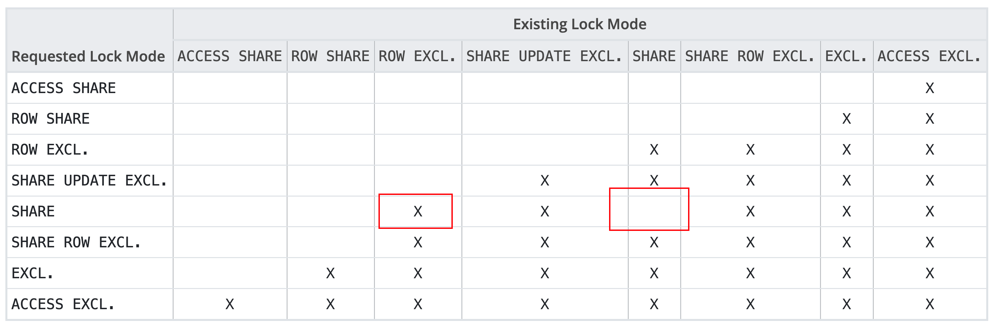

## 0x01-8级锁的不对称性

`2024-08-17 00:14:26 +0800`


用于创建索引的 `SHARE LOCK`，虽然和修改时需要的 `ROW EXCL` 锁冲突，却不和自己冲突。虽然创建索引时不能插入数据，但是可以创建其他索引。 `SHARE` 这个名字非常贴切。




注意：create index 可以事务块中执行

```
test=# begin transaction;
BEGIN
test=*# insert into test values (1);
INSERT 0 1
test=*# create index on test (a);
CREATE INDEX
test=*# commit;
COMMIT
```

而为了不阻塞读写，持有 `SHARE UPDATE EXCL` 锁的行为， 例如 `vacuum` ,  `create index concurrent` ，大都不能在事务块中进行。原因可能是这些操作需要感知其他正在执行的事务的状态(status of running processes)，其行为超出了一般意义上 MVCC 的。
