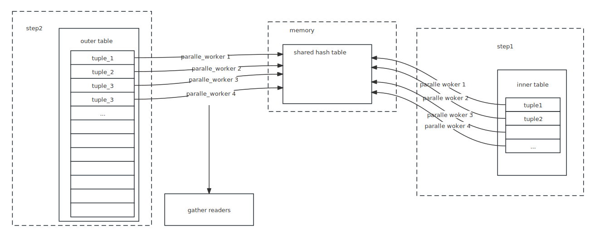
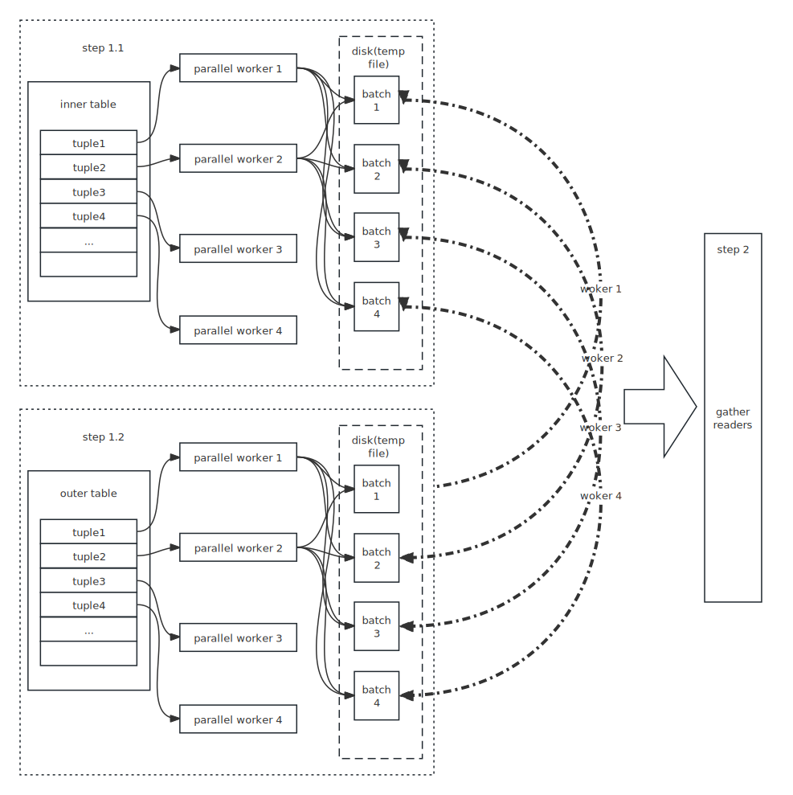

## high level view

See [Queries in PostgreSQL: 6. Hashing](https://postgrespro.com/blog/pgsql/5969673)

### One-pass hash join
Note that join in PostgreSql, we scan the right relation first, which means that
the right relation is the "inner relation" and the left relation is the outer
one.


### Two-pass hash join
Since we can't allocate as much memory as we want, instead of building a hash
table of the entire table, PG split the tables to several `batches` where all
tuples have the same hash value flag.

Batches are splited by hash value. Use several bits in hash value as a flag so
we can put the tuples into different batches.

There is a simple optimization that we can build the hash table in the first batch while scanning the inner table, and match the pair while scanning the outer table.


### parallel one-pass hash join



With parallel workers, we can

* scan inner table and build shared hash table parallelly
* scan outer table parallelly


Although in most cases, the neck of tp system is disk io, but parallel workers can still advance the speed efficiently. Because:

* In single process situation, the disk IO is synchronous，which means CPU is in idle while waiting IO. So, in the parallel case, CPU can be utilized more sufficiently.
* OS may has the technique to load the disk's content in advance, which is perdicularly useful in sequence scan. So multi-workers can read data file content more efficiently.
* In hash join, the compute of hash value may cost more CPU resource than normal TP operation.

### parallel two-pass hash join



Same as the basic two-pass hash join, parallel workers build batches parallelly, both in reading from inner/outer tuple and writing data to tmp file. Since no worker can obtain a whole batch's data in the first scan, the technique described above can be used here.

## Low level complement

### Single process

#### inner join
[What is inner join](https://www.w3schools.com/sql/sql_join_inner.asp)

This is the simplest join method in hash join. So we introduce a simple hash join state machine here. (See `ExecHashJoinImpl` for detail )


```
START WITH:
    state ==> HJ_BUILD_HASHTABLE

case HJ_BUILD_HASHTABLE:
    state ==> HJ_NEED_NEW_OUTER

case HJ_NEED_NEW_OUTER:
    ### generate a new outer tuple
    state ==> HJ_NEED_NEW_BATCH ### No more tuple in this batch.
          ==> HJ_SCAN_BUCKET;   ### Find a outer tuple. Can this one matches a
                                    inner one?

case HJ_SCAN_BUCKET:
    ### Scan the selected hash bucket for matches to current outer
    state ==> HJ_NEED_NEW_OUTER ### Whether we can find a match or not, we
                                    always generate a new outer tuple.

case HJ_NEED_NEW_BATCH:
    ### Try to advance to next batch
    state ==> HJ_NEED_NEW_OUTER;
          ==> FINISH
```

#### right join
To complete right join, we can just emit each outer tuple even if there's no
matched innner tuple.

```
case HJ_SCAN_BUCKET:
    state ==> HJ_FILL_OUTER_TUPLE  ### Can not find a match. Is it a left join?
          ==> HJ_NEED_NEW_OUTER

case HJ_FILL_OUTER_TUPLE:
    state ==> HJ_NEED_NEW_OUTER;    ### Whether emit the outer tuple with
                                        null-filled left tuple or not, we always
                                        generate a new outer tuple.
```

#### left join
To complete this, we must remember whether a inner tuple has been matched. So
```
case HJ_NEED_NEW_OUTER:
    state ==> HJ_FILL_INNER_TUPLES  ### This batch has been finished, see if
                                        there are unmatched inner tuples.
          ==> HJ_NEED_NEW_BATCH
          ==> HJ_SCAN_BUCKET

case HJ_FILL_INNER_TUPLES:
    state ==> HJ_NEED_NEW_BATCH     ### No more unmatched inner tuples, so start
                                        the next batch
          ==> HJ_FILL_INNER_TUPLES  ### return an unmatched inner tuple.
```

#### summary
Until now, we can generate a full state machine in non-parallel mode
```
START WITH:
    state ==> HJ_BUILD_HASHTABLE

case HJ_BUILD_HASHTABLE:
    state ==> HJ_NEED_NEW_OUTER

case HJ_NEED_NEW_OUTER:
    ### generate a new outer tuple
    state ==> HJ_FILL_INNER_TUPLES  ### This batch has been finished, see if
                                        there are unmatched inner tuples.
          ==> HJ_NEED_NEW_BATCH ### No more tuple in this batch.
          ==> HJ_SCAN_BUCKET;   ### Find a outer tuple. Can this one matches a
                                    inner one?

case HJ_SCAN_BUCKET:
    ### Scan the selected hash bucket for matches to current outer
    state ==> HJ_FILL_OUTER_TUPLE  ### Can not find a match. Is it a left join?
          ==> HJ_NEED_NEW_OUTER ### Whether we can find a match or not, we
                                    always generate a new outer tuple.

case HJ_NEED_NEW_BATCH:
    ### Try to advance to next batch
    state ==> HJ_NEED_NEW_OUTER;
          ==> FINISH
```

### parallel hash

>  Note that `BarrierArriveAndWait` will increase current phase. So each phase's status is not be assigned directly but self-increased.

Let introduce the state machine first
```
START WITH:
case HJ_BUILD_HASHTABLE:
    ### If multi-batch, we need to hash the outer relation up front.
    ExecParallelHashJoinPartitionOuter(node);
    state ==> HJ_NEED_NEW_BATCH ### Select a batch to work on.

case HJ_NEED_NEW_OUTER:
    ExecParallelHashJoinOuterGetTuple
        sts_parallel_scan_next
    
case HJ_NEED_NEW_BATCH:
    ExecParallelHashJoinNewBatch()
        switch PHJ_BATCH_STATE
            case PHJ_BATCH_ELECT:
                ### One backend allocates the hash table
                ExecParallelHashTableAlloc
                ### Fall through
            case PHJ_BATCH_ALLOCATE:
                ### Wait for allocation to complete and Fall through
            case PHJ_BATCH_LOAD:
                ### Start (or join in) loading tuples and Fall through.
            case PHJ_BATCH_PROBE:
                ### This batch is ready to probe
                ExecParallelHashTableSetCurrentBatch
                return true;
            case PHJ_BATCH_SCAN:
                ### detach and go around again
            case PHJ_BATCH_FREE:
    state ==> HJ_NEED_NEW_OUTER

```

```
    PHJ_BUILD_ELECT ==> PHJ_BUILD_ALLOCATE
```

```
ExecParallelHashJoinNewBatch
```

## Code level Detail

### utility

* `ExecHashGetBucketAndBatch` : hash value to bucket number and batch number

```
ExecHashGetBucketAndBatch(HashJoinTable hashtable,
                          uint32 hashvalue,
                          int *bucketno,
                          int *batchno)
{
    uint32      nbuckets = (uint32) hashtable->nbuckets;
    uint32      nbatch = (uint32) hashtable->nbatch;

    if (nbatch > 1)
    {
        *bucketno = hashvalue & (nbuckets - 1); ### tricky way as MOD
        *batchno = pg_rotate_right32(hashvalue,
                                     hashtable->log2_nbuckets) & (nbatch - 1);
        ### rotate hashvalue and MOD nbatch
    }
    else
    {
        *bucketno = hashvalue & (nbuckets - 1);
        *batchno = 0;
    }
}
```

* `ExecHashTableInsert` : insert hash value

```
ExecHashTableInsert
    ExecHashGetBucketAndBatch(hashtable, hashvalue,
                              &bucketno, &batchno);
    if (batchno == hashtable->curbatch) ### put into hash table
        hashTuple = (HashJoinTuple) dense_alloc
        hashtable->spaceUsed += hashTupleSize;

        ### For single batch, we may increase the nbucket
        if (hashtable->nbatch == 1)
            if (ntuples > (hashtable->nbuckets_optimal * NTUP_PER_BUCKET) && xxx)
                hashtable->nbuckets_optimal *= 2;
                hashtable->log2_nbuckets_optimal += 1;

        ### For multi-batches, we may increase the batches
        if (hashtable->spaceUsed +
            hashtable->nbuckets_optimal * sizeof(HashJoinTuple) +
            > hashtable->spaceAllowed)
            ExecHashIncreaseNumBatches()
    else    ### put the tuple into a temp file for later batches
        ExecHashJoinSaveTuple()
```

* `ExecHashIncreaseNumBatches` : increase batches

```
ExecHashIncreaseNumBatches
    nbatch = oldnbatch * 2; ### double nbatches

    ### init/update batchfiles
    if (hashtable->innerBatchFile == NULL)
        hashtable->innerBatchFile = palloc0_array(BufFile *, nbatch);
        hashtable->outerBatchFile = palloc0_array(BufFile *, nbatch);
        PrepareTempTablespaces();
    else
        hashtable->innerBatchFile = repalloc0_array()
        hashtable->outerBatchFile

    ### resize nbuckets?
    if (hashtable->nbuckets_optimal != hashtable->nbuckets)
        hashtable->nbuckets = hashtable->nbuckets_optimal;
        hashtable->log2_nbuckets = hashtable->log2_nbuckets_optimal;
        hashtable->buckets.unshared = repalloc_array()

    ### scan through allchunks
    while (oldchunks != NULL)
        nextchunk = oldchunks->next.unshared

        ### scan through all tuples in the chunk
        idx = 0
        while (idx < oldchunks->used)
            HashJoinTuple hashTuple = (HashJoinTuple) (HASH_CHUNK_DATA(oldchunks) + idx);
            ...

            ### where should the tuple go?
            ExecHashGetBucketAndBatch(hashtable, hashTuple->hashvalue,
                                      &bucketno, &batchno);
            if (batchno == curbatch)
                ### keep the tuple but copy it into the new chunk
                copyTuple = (HashJoinTuple) dense_alloc(hashtable, hashTupleSize);
                hashtable->buckets.unshared[bucketno] = copyTuple;
            else
                ### dump it out
                ExecHashJoinSaveTuple()
            idx += MAXALIGN(hashTupleSize);

        pfree(oldchunks);
        oldchunks = nextchunk;
```

* `ExecHashJoinSaveTuple` : save a tuple to a batch file.
  
```
    BufFileWrite(file, &hashvalue, sizeof(uint32));
    BufFileWrite(file, tuple, tuple->t_len);    ### len is record in 
                                                    MinimalTupleData structure
```


### single worker

#### build state 

```
MultiExecProcNode
    MultiExecPrivateHash
        for (;;)
            slot = ExecProcNode(outerNode);
            if (ExecHashGetHashValue())
                bucketNumber = ExecHashGetSkewBucket
                if (bucketNumber != INVALID_SKEW_BUCKET_NO) ###  skew tuple
                    ExecHashSkewTableInsert
                else
                    ExecHashTableInsert	### normal tuple
            hashtable->totalTuples += 1;
```
xxx
