# 1 概述
本文介绍 PostgreSQL 中 Heap Only Tuple(HOT) 技术以及创建索引相关的知识，主要包含以下内容：
1. HOT 的基本原理
2. 普通的创建索引 (Create Index) 流程
3. 同时创建索引 (Create Index Concurrently CIC) 的原理

本文不包括：
1. btree 等索引的具体实现方式
2. PostgreSQL 对索引访问方式 (Access Method) 的抽象

# 2 HOT 基础
简单而言, HOT(Heap Only Tuple) 指没有索引指向的元组，用于消除元组更新引起的索引膨胀，原理如下图：

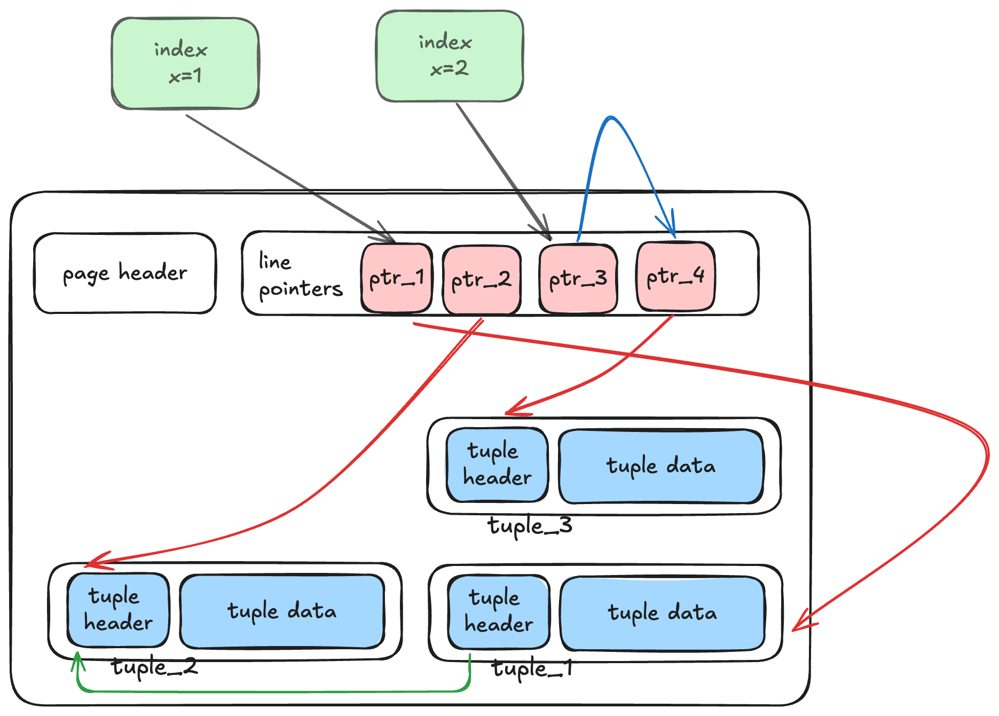

1. 元组指向另一个元组：索引指向 line_ptr_1 ，line_ptr_1 指向 tuple_1 ，tuple_1 被更新后成为 tuple_2，此时 tuple_1 指向 tuple_2，而索引指向的 line pointer 没有发生变化。 
2. line pointer 也可以指向另一个 line pointer：索引指向 line_ptr_3 , line_ptr_3 指向 line_ptr_4 ，line_ptr_4 指向 tuple3

显然，HOT 技术具有如下优点

1. 对于被更新的元组，无需创建新的索引指针指向新元组
2. 旧元组可以被“普通操作”删除掉，并不一定需要 vacuum （相当 vacuum 的工作被分给了普通的 dml ）


同时，触发 HOT 链也需要严格的限制：

1. 该更新不会修改表的索引所引用的任何列，不包括汇总索引
2. 包含旧行的页面有足够的空闲空间用于存放更新后的行，即，HOT 链不能跨 page

## 2-1 HOT 链的构建
（一）：表 tbl(x int, y int) 在 x 上有索引，先插入一行  tuple_1=(x=1, y=1) ，结果如下

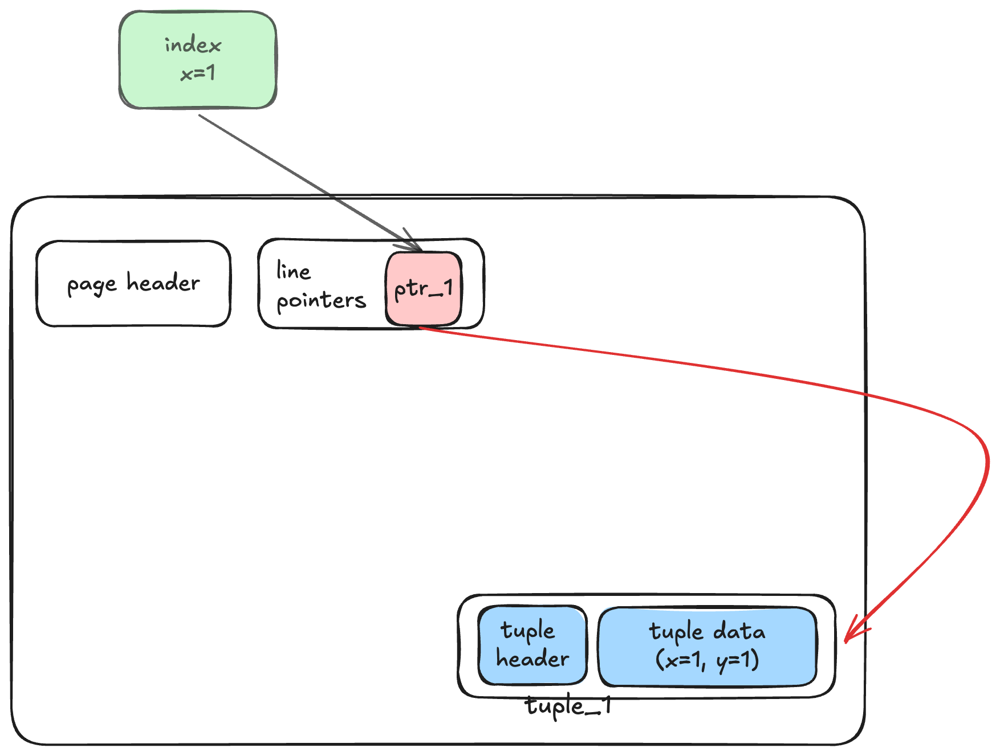

（二）：当更新 tuple_1 为 (x=1,y=2) 时， 新增 lp_2, 和 tuple_2 ，但是不会新增索引指针，而是由 tuple_1 的 header 会记录 tuple_2 的位置。

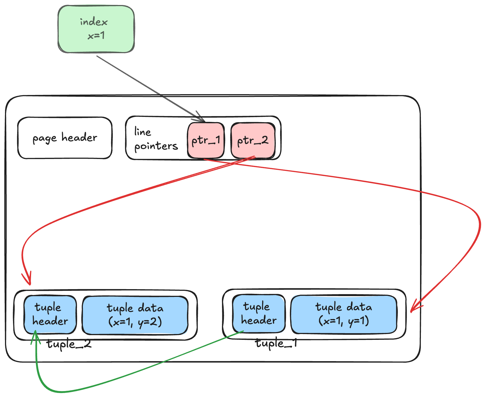

从可见性的角度思考，对于一个快照而言，一个 HOT 链上最多只有一个 tuple 可见。

所以使用索引扫描时，会先找到 tuple_1 判断 tuple_ 1 是否符合可见性：

1. 如果 tuple_1 可见，那么立即返回，不在向下搜索。
2. 如果 tuple_1 不可见，再继续向下搜素。


（三）：再更新 tuple_1 为 tuple3=(x=1, y=3)，结果如下

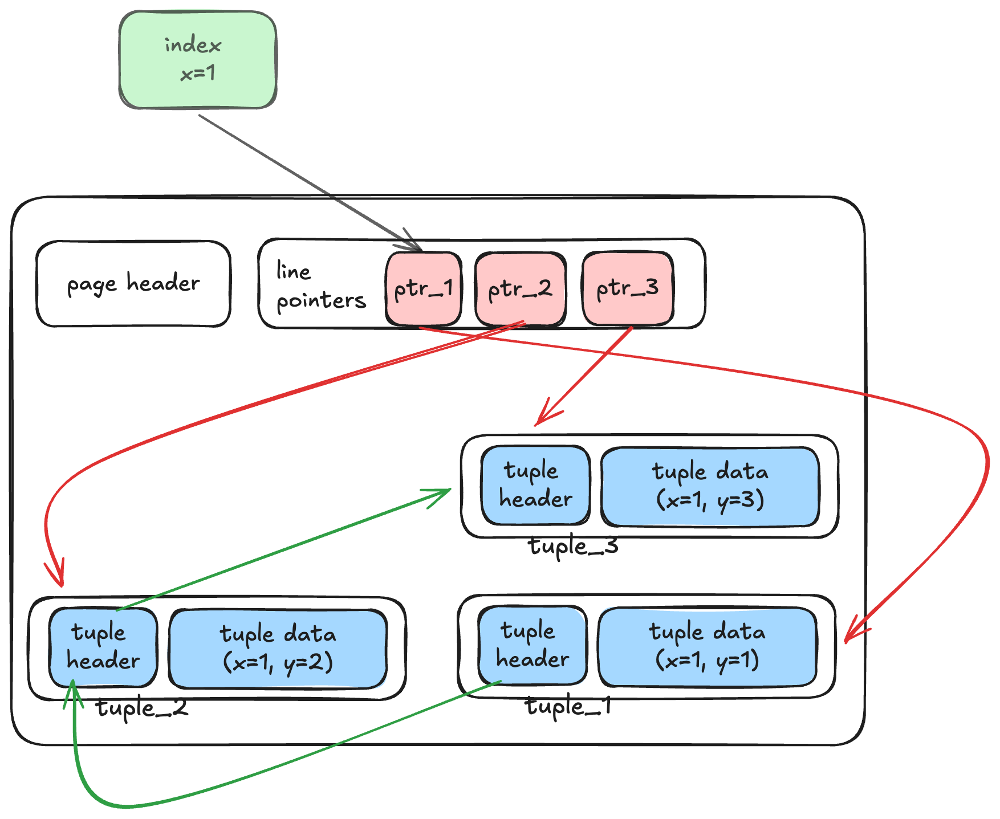

## 2-2 清理

显然如果一个tuple一直被更新，那么其 HOT 链会很长，影响索引搜索的性能，所以需要去清理 HOT 链，清理分为两步，一个是 pruning （修剪），另一个是 defragmentation （碎片整理）

（四）：pruning （修剪）：等 tuple_1 和 tuple_2 多所有事务都不可见时，则通过修改 line pointers，减少 hot 链的长度。 line pointer 2 可以被其他操作复用，但是 tuple_1 和 tuple_2 占用的空间仍没有被清理。如图：

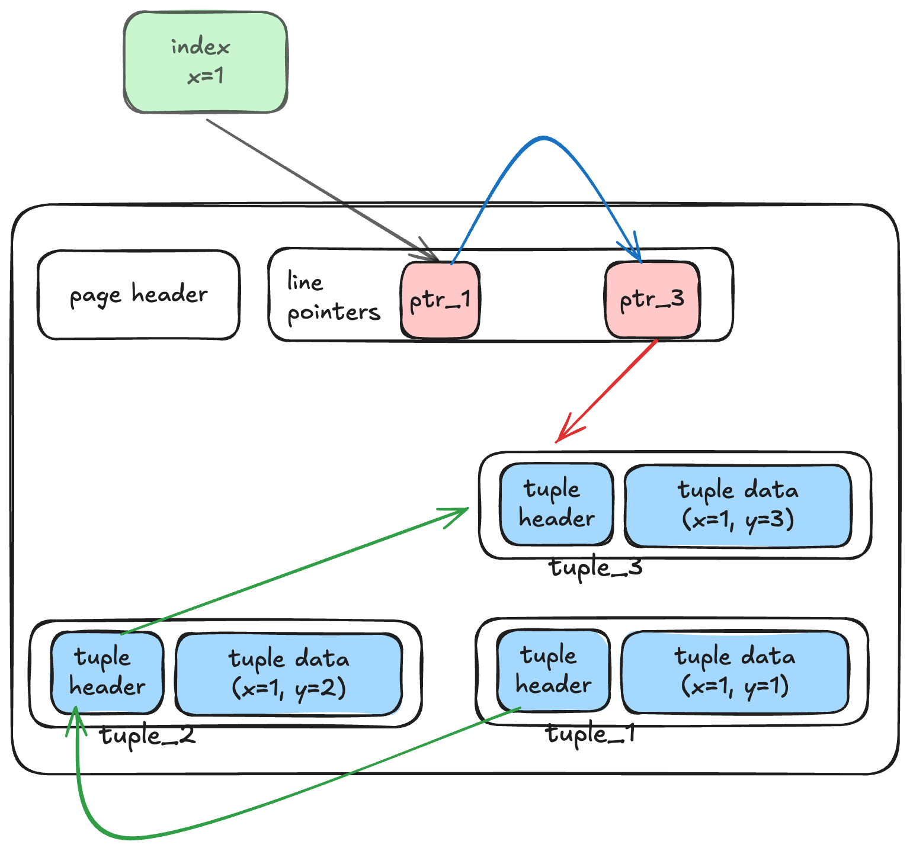

（五）：defragmentation （碎片整理）：将对应的 tuple 彻底删除，如图

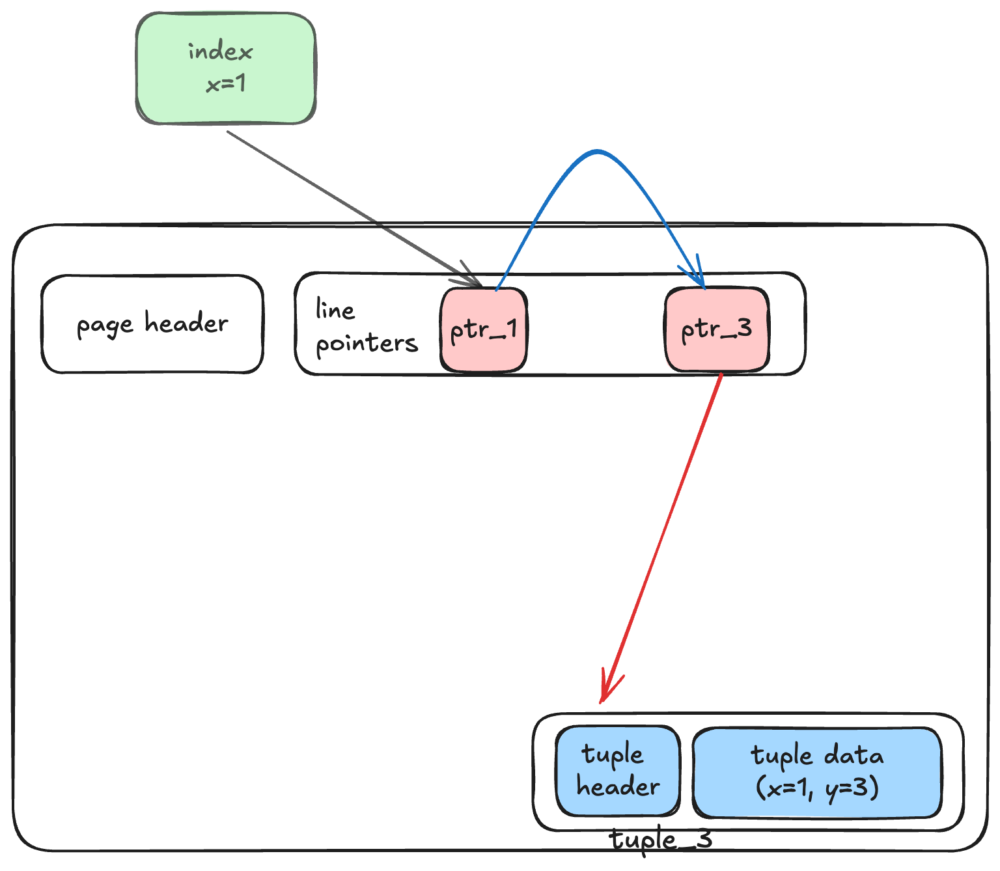

# 3 Create Index 的流程

该章节介绍普通的创建索引的大致过程，尤其是缓存一致性和对 HOT 的特殊处理

## 3-1 准备步骤

1. 权限校验：包括
2. 选择索引名， access method （主要是确认 access method 是否存在）
3. 加锁：shared lock，阻止写入

## 3-2 创建空索引

1. 创建 heap `heap_create`
   1. build relcache
   2. 创建文件 `smgrcreate`
   3. 记录依赖
2. 向 `pg_class` , `pg_index` , `pg_attribute`  中写入对应的记录
3. 注册对应表的缓存无效信息，以便在事务结束时发送 `CacheInvalidateRelcache`


## 3-3 调用对应的 index access method 创建索引

这里和 HOT 关系较大，需要简单展开：

在 index access method 内部，会使用回调函数 `heapam_index_build_range_scan` 来扫描 heap，以确定有哪些 tuple 需要加入到索引中：

1. 该扫描使用的快照为 `SnapshotAny` ，即所有元组都需要被处理。
2. 每当扫描到一个元组时，需要像 `vacuum` 一样判断该元组的状态，包括：
   1. 对所有事务都不可见 (`HEAPTUPLE_DEAD`) ，那么显然不需要对他创建索引
   2. 如果所有事务都可见 (`HEAPTUPLE_LIVE`)，那么显然需要对他创建索引
   3. 如果一些事务可见：
      1. (`HEAPTUPLE_RECENTLY_DEAD`) ，最近被删除，但是有些事务仍然可以看到 （重点处理）：
      2. (`INSERT_IN_PROGRESS`) 和 (`DELETE_IN_PROGRESS`) ，正在被插入、删除 ：考虑到大部分情况下 `create index` 语句不会在事务块中执行，这里跳过。

## 3-3-1 如何处理 `HEAPTUPLE_RECENTLY_DEAD`

### 3-3-1-1 非 HOT

说明该 tuple 被删除了，但是有一些事务仍然对其可见，那么也需要加入到索引中。否则这些事务后续通过当前创建的索引就无法找到该元组。

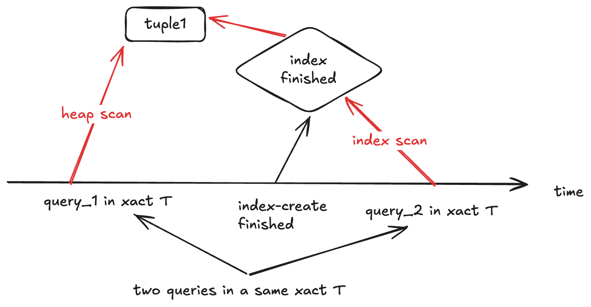

注意：在判断一个表有哪些索引时，使用快照是“最新的快照”，而非当前事务的快照。

### 3-3-1-2 HOT

如果该 tuple 在 HOT 链中，问题就有些棘手。

1. 此时不方便将 HOT 链破坏掉。（创建索引的时候直接修改 HEAP 中内容确实不算合理）
2. 但如果不破坏，就（必须）将该 tuple 加入到新索引中，而该 HOT 链可能和新索引冲突


为此，PostgreSQL 采取了一种巧妙地方式

1. 不将该 tuple 加入到新索引中
2. 对于一些仍然可以访问该 tuple 的事务，阻止其使用新索引。


阻止的方式为：pg_index 中有字段 `indcheckxmin` 。当该字段为 true 时，如果事务 T 想要使用该索引，需要确保自己最旧的快照在创建索引的快照之后，即事物 T 的 `TransactionXmin` （逻辑）大于 `pg_index`  中对应 tuple 的 `xmin` 

1. `TransactionXmin` 表示当前事务的所有快照中，最小的的 xmin。（快照中， `xmin` 前的事务都结束了）
2. `pg_index`  中对应 tuple 的 `xmin` 表示 该索引创建的 xid

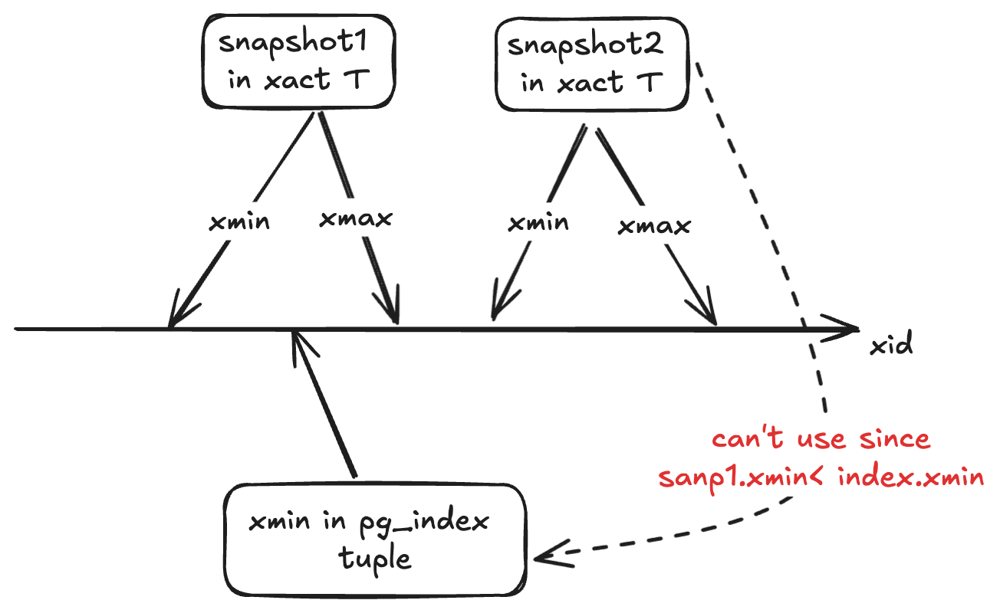


## 3-3-2 对 HOT 链上的元组构建索引

由于创建新索引会导致已有的 HOT 链无效，这里还需讨论如何将已有 HOT 链中元组如何构建到索引中。考虑如下情形，现在需要对 `y` 这一列创建索引，只需要将 tuple_3 加入到索引中(y=2)即可。由于一个 line pointer 只能在一个 HOT 链中，所以此时索引应该指向 lp_1（注意 tuple_1 有 y=1)。

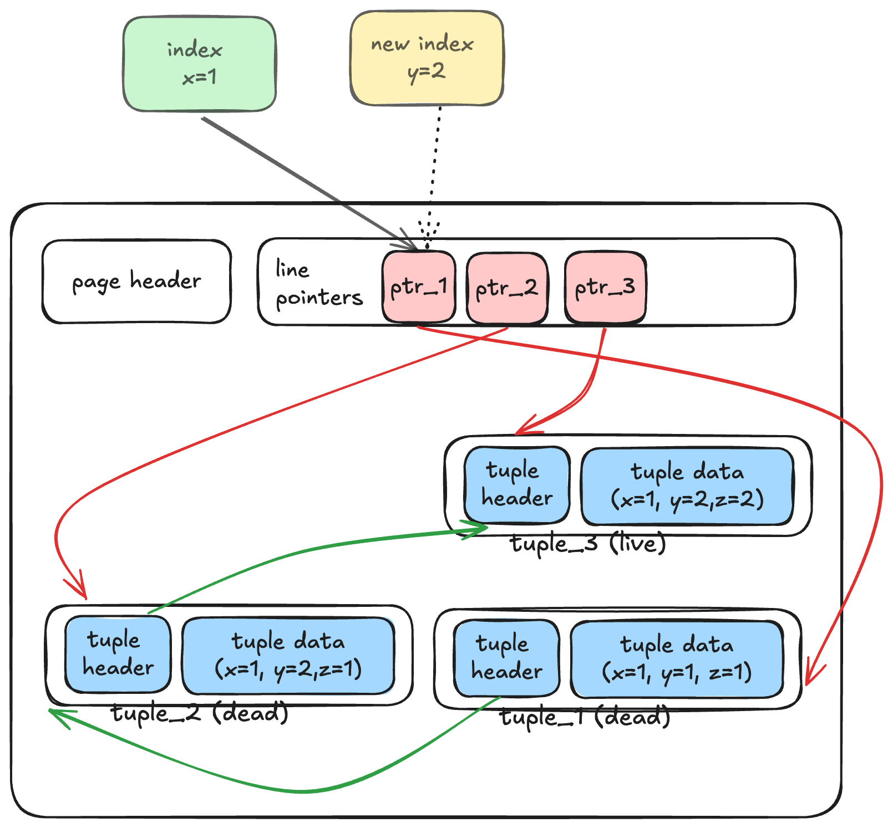


如果想去“优化“ 新HOT链的长度，让索引指向 lp_2 或者 lp_3，会产生很多问题，例如指向 lp_3，如果后续更新 tuple3 为 tuple4(x=1,y=2,z=3)，旧很难清理 HOT 链，

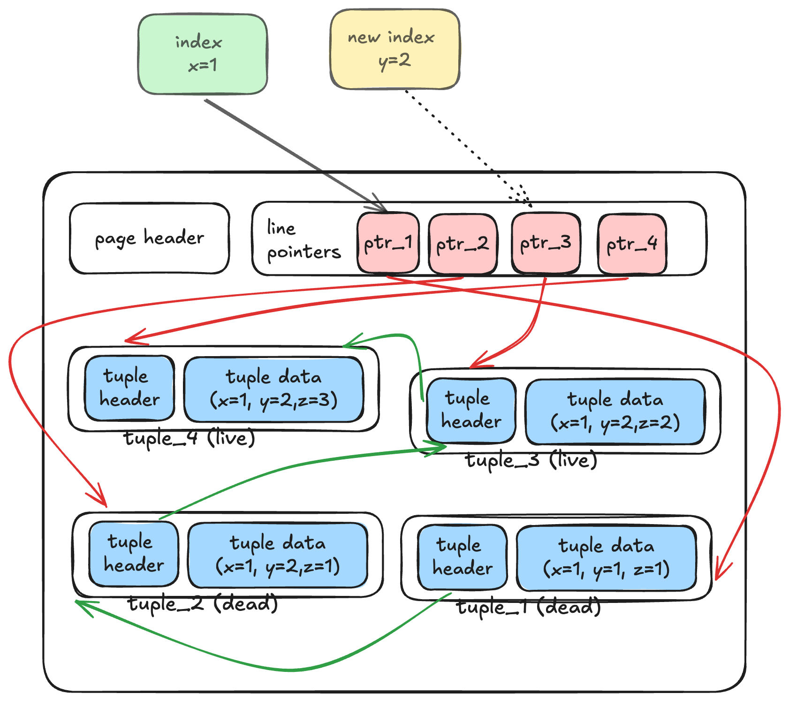

在清理时还需要注意 ptr_3 有索引指向，造成代码复杂度很高

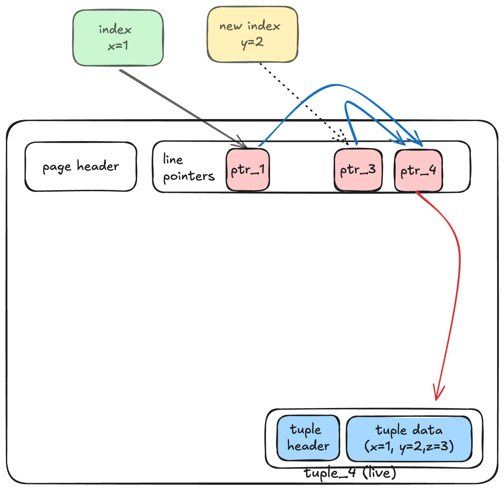

# 4 Create Index Concurrently (CIC) 的原理解析
* 解决的问题：
  * 同步创建索引 `create index concurrently` 解决了创建索引期间，`DML` 语句会被阻塞的问题。
* 思路：
  * 和 `pg_repack` , `pg_squeeze` 等重写表的工具相似，内核中实现的同步创建索引也使用了 “存量 + 增量” 的方式。
  * 不同的是，官方提供的同步创建索引功能，几乎没有和任何其他特性耦合，例如没有使用触发器和逻辑复制。


难点有：
1. 在不同的字段上，新创建一个索引会破坏 `heap` 中的原 `HOT` 链，创建的过程中也会影响到新的 `HOT` 链。
2. 在不使用触发器和逻辑复制等功能的情况下，如何记录增量数据？


简单流程：通过三个事务完成

1. 阶段一：创建索引文件和修改系统表。 此时索引为 `not ready` + `not valid`。但其他 SQL 需要遵循对应的 HOT 规则。
2. 阶段二：获取快照 `A` ，使用对该快照可见的元组创建索引，并设置为 `ready` 。阶段二结束后，其他 SQL 修改表时，也需要修改该索引。
3. 阶段三：获取快照 `B` ，将快照 `B` 可见但快照 `A` 不可见的元组插入索引，并设置为 `valid` ，查询可以使用该索引。

## 4-1 阶段一：创建空索引

创建空索引的核心原因是：在将存量数据加入的索引中时，确保其他连接的修改不会破坏 HOT（更近一步的原因在阶段 2 描述）。方式为向 pg_index 中记录一个 `indisready==false && indisvalid==false` 的索引。所以问题在于：其他连接如何感知到该索引。

每个连接都会缓存自己 `relcache` 和 `syscache` ，如果没有接收到缓存失效信息，这些缓存会一直保留。一般而言，事务开始时，会处理所有的缓存失效消息，在事务的执行的过程中，也有埋点来处理失效信息。而且，处理结果不会返回给发送端。

所以为了保证其他连接都会看到新索引，简单的想法是：在创建空索引的事务结束后，需要等到当前所有其他事务全部结束，才能开启第二阶段。


实际上，代码实现与上述有所差别：

PostgreSQL 中，还有一处会处理失效信息：当进程执行修改表的操作时，需要打开表获取 `relcache` ，而在打开表操作时，会处理缓存失效信息。打开表获取 relcache ：

```
relation_open/try_relation_open -> LockRelationOid -> AcceptInvalidationMessages
```

所以此时：如果当前执行 CIC 的连接，可以获取到该表的 `ShareLock` lock，可以说明

1. 此时没有其他事务打开了该表并会能修改：因为 `SharedLock` 仅不与 `select` 、 `select for update/share` 相冲突，与任何修改表的锁相冲突
2. 后续打开该表的事务，都会处理之前发送的缓存失效信息，可以感知到该空索引

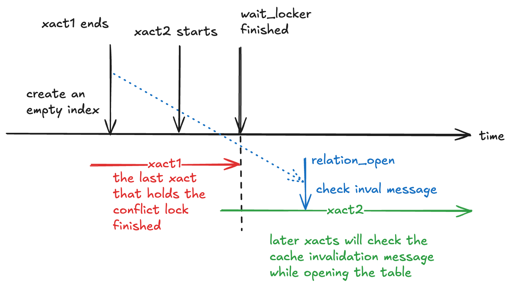

具体代码为 lmgr 层的 `WaitForLockers` 函数

```c
/*
 * Now we must wait until no running transaction could have the table open
 * with the old list of indexes.  Use ShareLock to consider running
 * transactions that hold locks that permit writing to the table.  Note we
 * do not need to worry about xacts that open the table for writing after
 * this point; they will see the new index when they open it.
 */
WaitForLockers(heaplocktag, ShareLock, true);
```

## 4-2 阶段二：使用存量数据创建索引

在确保所有连接都发现了该索引时，可以使用存量数据创建索引

该过程和普通的创建索引相似，但是进行 `heap` 扫描时，使用的快照不同。在一般的索引创建中，使用的是 `SnapshotAny` ，所有行都可见，而 CIC 中使用的是当前事务的快照。

问题仍然出现在 HOT 链上，虽然对于创建索引的字段，当前不会产生新的 HOT 链，但是仍然会有旧的 HOT 链 ，所以构建索引的方式和普通地创建索引相同。

举个例子:

- 初始状态有 tuple_1 和 tuple_2 ，以及字段 a 上的索引。现对字段 b 创建建索引，
- tuple_1 对当前快照不可见（too old）
- tuple_2 可见。当把 tuple_2 加入到索引中时，索引值为 b=2，但索引入口指向 b=1 的元组（HOT链的开头），
- 在阶段2中，有其他事务将 tuple_2 进行成了 tuple_3 ，将 c 改为了 2。该更新满足 HOT （a, b 都没有变），所以仍在 HOT 链上。但是 tuple_3 对当前快照（CIC）不可见 (in feature)，所以不处理。
- 在阶段2中，有其他事务将 tuple_3 进行成了 tuple_4，将 b 改为了3。该更新不满足 HOT，所以索引 idx_a 需要创建新的指针

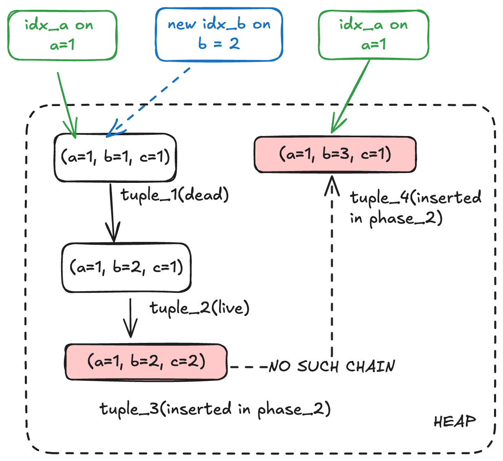

当索引构建完毕后，将 pg_index 的中对应行的 `indisready` 设置为 true，这样其他事务后续修改表时，会同步修改该索引。和阶段1相似，当前事务提交后，开启新的事物（xact3），等到其他事务都感知到 `indisready=true` 时（同样使用 WaitForLockers 方案），开始阶段三。

## 4-3 阶段三： 增量数据的插入

该步骤的主要工作为把阶段二中遗漏的 tuple 加入索引中。方法为：使用当前的事务快照，将该快照可见的但是索引中没有的元组，加入索引中，具体做法为：

（一）扫描索引，获取索引中所有的 ctid，并进行排序，得到 `Tuplesortstate`

（二）使用当前快照，进行全表扫描，对于每一行，在 `Tuplesortstate` 搜索对应的 ctid。注意，如果全表扫描得到的是 heap only tuple，则使用其根 tuple 的 ctid。如果在 `Tuplesortstate` 中没有找打，则将该元组插入到索引中。

举个例子： tuple_3 虽然是在阶段二中新增的 tuple ，但是其根 tuple，即 tuple_1 已经在索引中了，所以在阶段三中忽略。而 tuple_4 不在 HOT 链中，也不在索引中，所以需要插入到索引中。

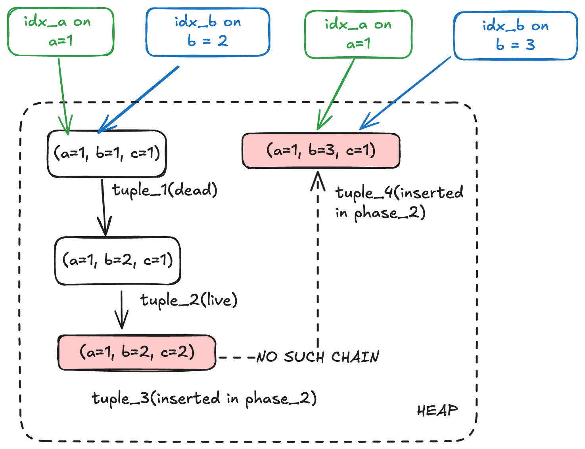

增量数据插入结束后，仍不能设置 `indisvalid=true` ：考虑一个元组，它在阶段二中被创建，却在阶段三前被删除，所以此时该元组仍然不在索引中，但是可能有其他事务（事务 T）可以看到该元组，故此时需要等事务 T 结束。由于无法确保事务 T 会修改表，所以这里不能使用阶段一中的 `WaitForLockers` 方法，只能等待。


所以流程为将增量数据插入元组后，获取当前快照的 xmin，记为 xminlimit，并提交。之后开启新的事物，等待所有含有 `snap.xmin<xminlimit` 的快照的事务全部提交，再设置 `indisvalid=true` 并提交。

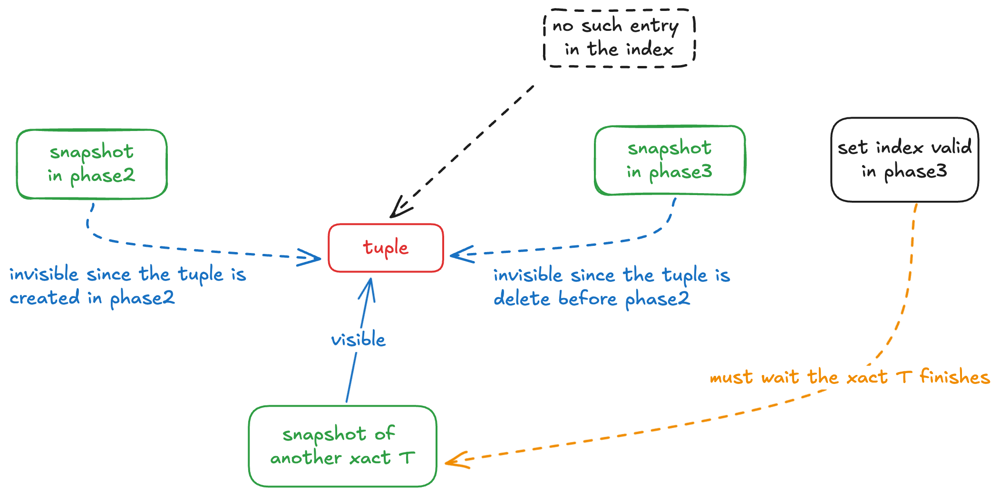


提交后，所以事务（包括正在运行的）都可以使用新索引了。


## 4-3 FAQ

### 4-3-1 unique index

问题：创建 unique index 时，阶段二和阶段三的两次插入，会引起 unique index 的冲突？


unique 冲突都是在各自索引的 `aminsert` 中实现的，只有 btree 实现了 unique 特性

 举例1：表有 a,b 三个字段，其中 a 上有索引

1. tuple_1(1,1) 在阶段二中被加入到索引中。
2. 在阶段二中，有其他事务将 tuple_1 更新为了 tuple_2(2,1)
3. 在阶段三中，将 tuple_2 插入到索引中时，索引发现 tuple_1 可能，使用 `SNAPSHOT_DIRTY` 看 tuple_1 ，发现 tuple_1 已经被删除，所以实际上没有冲突，该情况和一般的索引插入相同：

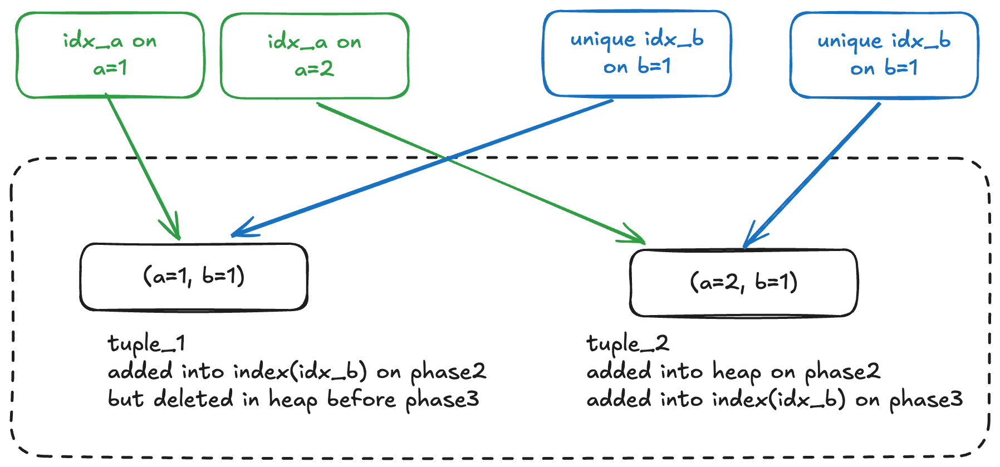


举例2：表有 a,b 三个字段，其中 a 上有索引

1. tuple_1(1,1) 在阶段二中被加入到索引中。
2. 在阶段二中，有其他事务将 tuple_1 更新为了 tuple_2(2,1)
3. 在阶段三中，有其他事务将 tuple_2 更新为了 tuple_3(3,1)，而此时执行 CIC 的事务快照只能看见 tuple_2
4. 在阶段三中，将 tuple_2 插入到索引中时：
   1. 发现 tuple_1 可能有冲突，使用 `SNAPSHOT_DIRTY` 看 tuple_1 ，发现 tuple_1 已经被删除，所以实际上没有冲突
   2. 发现 tuple_3 可能有冲突，使用 `SNAPSHOT_DIRTY` 看 tuple_3 ，发现 tuple_3 没有删除，此时再使用 `SNAPSHOT_SELF` 看  tuple_2 （即将要插入的元组），发现 tuple_2 已经被删除，故插入失败，但不报错。

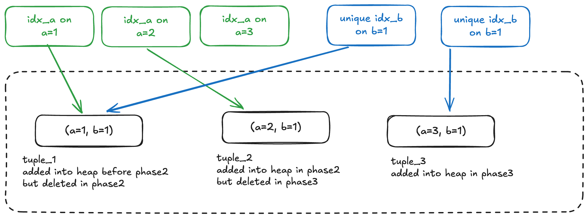
