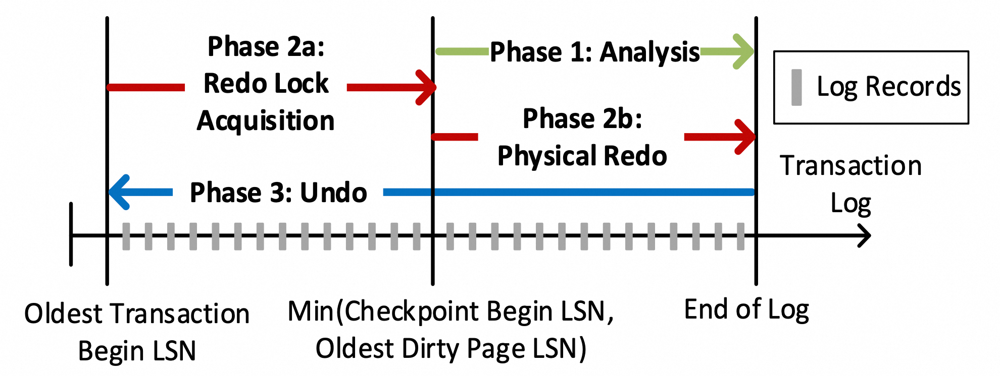
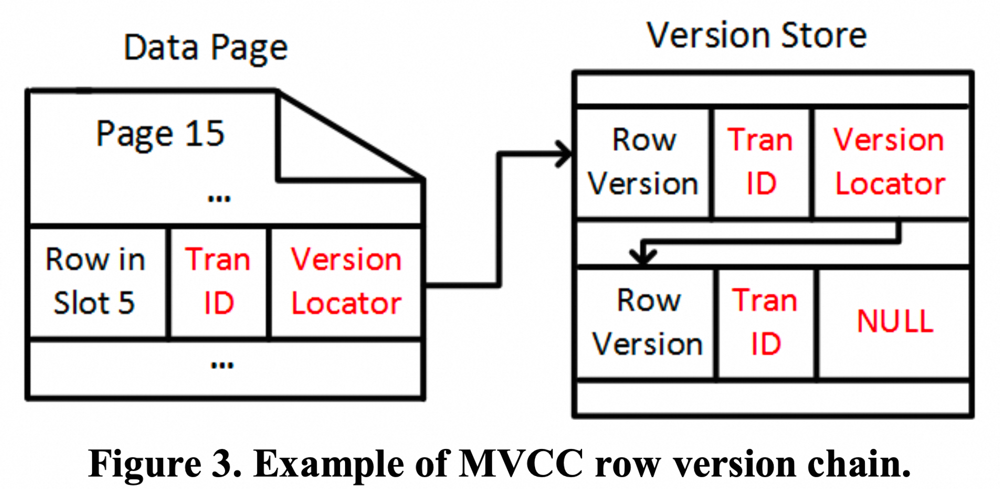

## 0x0 backgroud

Even though ARIES simplifies the recovery process and allows it to be generic for all transactional operations, **recovering the database to a consistent state requires undoing all operations performed by uncommitted transactions** which makes the cost of recovery proportional to the work performed by these transactions. This significantly impacts database availability since **recovering a long running transaction can take several hours**.

This paper describes the overall design of “**Constant Time Recovery**” (CTR) 

**Recovering the database to a consistent state requires undoing all operations performed by uncommitted transactions, and recovering a long running transaction can take several hours**

## **0x1 BACKGROUND ON SQL SERVER**

### **0x11 DatabaseRecovery**

**Following ARIES**, the SQL Server recovery process has three distinct phases. Figure 2 demonstrates these phases and the portion of the log they process.

(The oldest transaction can run across many checkpoints)

- analysis: identifys:
  - any transactions that must be rolled back
  - LSN of the oldest dirty page in the system
    - Checkpoint process captured all active transactions and the oldest dirty page LSN at the time of the checkpoint, so analysis can start from that
- redo: **bringing the database back to the state it was at the time of the failure:**
  - Since Analysis has recomputed the **Oldest Dirty Page LSN**, Redo should only process the log from this point.
    - Only applies the operation if the Page LSN is lower
  - Processes the log starting from the beginning of the **oldest active transaction**.
    - This allows recovery to **reacquire all the locks held by active transactions** and make the database **available at the end of Redo for improved availability**
- undo: **rolling back any transactions that were active at the time of the failure.**
  - As Redo has reacquired the locks required by these transactions, the Undo process can be performed while the database is available and user queries will be blocked only **if they attempt to access the data modified by the transactions pending undo**.
  - Undoing these operations is also logged using Compensation Log Records (**CLR**) to guarantee that the database is recoverable even after a failure in the middle of the Undo process

### **0x12 Multi-versionConcurrencyControl**

Versioning is performed at the row level: for every user data update, **SQL Server updates the row in-place in the data page and pushes the old version of the row to an append-only version store**, linking the current row version to the previous version

The versions are linked to each other using their physical locator

Given that these versions are only used for the purposes of SI, the version store doesn’t need to be preserved across restarts and is stored in SQL Server’s “TempDB”, a system database that is recycled every time the SQL Server process restarts. This allows for efficient version generation, as these operations are not logged.

## **0x2 CONSTANTTIMERECOVERY**

### 0x21 **Overview**

- Database recovery in constant time, regardless of the user workload and transaction sizes.
- Transaction rollback in constant time regardless of the transaction size.
- Continuous transaction log truncation, even in the presence of long running transactions.

CTR achieves these by separating transactional operations into three distinct categories and handling their recovery using the most appropriate mechanism.

### 0x22 three transactional operations categories

#### 0x221 Data Modifications

All data modifications are versioned, storing the earlier versions of each row in **the version store that is now redesigned to be persistent and recoverable**

（笑死我了，刚刚还在感叹 version store 无需记录，重启即删多么方便）

When a transaction rolls back, it is simply marked as “aborted”, indicating that any new transactions should ignore the versions generated by this transaction and access the earlier committed versions

During database recovery

- Analysis identifies the state of every transaction
- **Redo recovers the row and the version store** content as of the time of the failure.
- **Undo marks the uncommitted transactions as aborted** making all updates by these
  transactions invisible.
    - This allows Undo to complete in constant time, regardless of the transaction sizes.
    - （仍然和 aborted xact count 相关，但相比于 modified row count，几乎可以忽略不计）

#### 0x222 System Operations

System operations refer to internal operations the DBMS uses to maintain its internal data structures, such as space allocation and deallocation, B-Tree page splits, etc.

- difficulty:
  - These operations cannot be easily versioned
  - Additionally, these operations are usually tied to user data modifications and can be a significant percentage of the operations performed by a long-running transaction.
    - For example, a large data load allocates a large number of pages
- Solution:
  - These operations are always performed by short-lived, system transactions that update the internal data structures and immediately commit
  - **When a failure occurs, these operations will not be undone, but the allocated space and other updated data structures will be lazily reclaimed and fixed up in the background.**

### 0x223 Logical and Other Non-versioned Operations

This last category refers to operations that cannot be versioned because they are either:

- logical: such as
  - lock acquisition operations that indicate that a certain lock must be acquired during recovery
  - cache invalidation operations that are responsible for invalidating in-memory caches when a transaction rolls back
- they are modifying data structures that need to be accessed during start up
  - must maintain a very specific format that does not allow versioning
    CTR leverages an additional log stream, SLog, that allows tracking only the relevant operations and not having to process the full transaction log for the corresponding transactions.

### 0x23 Persistent Version Store

Persistent Version Store (PVS) allows **row versions to be recoverable** by storing them in the user database and **logging them in the transaction log as regular user** data.

- Hence, at the end of Redo all versions are fully recovered and can be accessed by user transactions

#### 0x231 In-row Version Store

Since in most cases the difference between the two versions is small (for example when only a few columns are updated), we can simply store the diff between the two versions

- Even though computing and reapplying the diff requires additional CPU cycles, the cost of generating an off-row version, by accessing another page and logging the version as a separate operation, is significantly higher （再读另一个页代价更大）

![[attachments/Pasted image 20240714101730.png]]

（ diff 怎么存储呢？定长的 id 字段可能不够！）

Despite its benefits in most common cases, in-row versioning can negatively impact the performance of the system if it significantly increases the size of rows in the data pages. This is particularly problematic for B-Trees as it can lead to page splits. （diff 会占用大量空间，引起 page 数量膨胀，B树分裂代价高 ）

#### 0x232 Off-row Version Store

It is implemented as an internal table that has no indexes since all version accesses are based on the version’s physical locator (Page Id, Slot Id) （纯 heap，无索引）

Each version of user data is stored as a separate row in this table, having some columns for persisting version metadata and a generic binary column that contains the full version content, regardless of the schema of the user table this version belongs to. （存全量数据，而不仅是 diff)

By leveraging regular logging, off-row PVS is recovered using the traditional recovery mechanisms

### 0x23 Logical Revert

#### 0x231 overview

CTR leverages the PVS to instantly roll back data modifications.

When a query accesses a row, it first checks the state (active, committed or aborted) of the transaction that generated the latest version.

- If the transaction is active or has been committed: visibility depends on the query isolation level. （ 事务提交，则看第一个 version ）
- but if the transaction is aborted, this version is definitely not visible and the query traverses the version chain to identify the version that belongs to a committed transaction and is visible. （ 事务回滚，则遍历 version chain ）

Additionally, if a new transaction updates a row with an aborted version, it must first revert the effects of the aborted transaction before proceeding with the update. （ 做完 redo 后，the latest version 可能是 abort 状态，真正有效的 version 在 version chain 中，所以需要修复 the latest version ）

CTR implements two different mechanisms for reverting the updates performed by aborted transactions:

**Logical Revert** is the process of bringing the committed version of a row back to the main row in the data page,

- so that all queries can access it directly and versions in the version store are no longer required
- This process compares the state of the aborted and committed versions and performs **the required compensating operation**
  - the revert operations are not versioned
- Since these transactions only revert a row at a time, they are guaranteed to be short-lived and don’t affect recovery time.
- Logical Revert **is used by a background cleanup process** to eliminate all updates performed by aborted transactions and eventually remove the aborted transactions from the system.
  ![[attachments/Pasted image 20240714110353.png]]

**overwrite** the aborted version with the new version it is generating

- This process minimizes the overhead for these operations and allows them to be almost as fast as if there was no aborted version.
  ![[attachments/Pasted image 20240714110439.png]]

In CTR, the database is fully available, releasing all locks, while row versions are lazily cleaned up in the background.

#### 0x232 Transaction State Management

For SI, visibility depends on the commit timestamp of the transaction that generated the version. Since SQL Server does not allow snapshot transactions to span server restarts, the commit timestamps can be stored in memory and need not be recovered. **CTR, however, requires tracking the state of aborted transactions until all their versions have been logically reverted and are no longer accessible.**

CTR stores the aborted transaction information in the “**Aborted Transaction Map**” (ATM)

Restore ATM after crash:

- When a transaction aborts, before releasing any locks, it will add its Transaction Id to the ATM and generate an “ABORT” log record indicating that it was aborted. （产生 ATM 信息）
- When a checkpoint occurs, the full content of the ATM is serialized into the transaction log as part of the checkpoint information. （ checkpoint 整理 ATM 信息 ）
- Since Analysis starts processing the log from the Checkpoint Begin LSN of the last successful checkpoint, or earlier, it will process this information regarding the aborted transactions and reconstruct the ATM. （ analysis 根据 checkpoint 重建 ATM ）
- Any transactions that aborted after the last checkpoint will not be included in the checkpoint, but Analysis will process their ABORT log records and add them to the map （ analysis 分析 checkpoint 后面事务的 ABORT log，并写入 ATM ）

Following this process, Analysis can reconstruct the ATM as of the time of the failure, so that it is available when the database becomes available at the end of Redo.

Once all versions generated by an aborted transaction have been reverted, the transaction is no longer interesting for recovery and can be removed from the ATM.

Removing a transaction is also a logged operation, using a “FORGET” log record, to guarantee that the content of the ATM is recovered correctly. （Removing from ATM 也要新加日志？这也太复杂了。。。。）

#### 0x233 Short Transaction Optimization

Maintaining the **Aborted Transaction Map** and forcing queries to visit additional versions incur a performance penalty, **short OLTP transactions as they would significantly increase the size of the ATM**

When a transaction attempts to roll back, we evaluate the **number of operations** it performed and the **amount of log** it generated and qualify it as “short” if these don’t exceed certain thresholds.

Short transactions will not go through the CTR rollback process, **but use traditional undo**, so that they are immediately removed from the system.
（ 太多短事务导致 ATM 膨胀，解决方案为混用 CTR 和 undo？这么复杂么？ ）

### 0x24 Non-versioned Operations

A variety of operations that cannot be versioned because they are:

- Logical: such as
  - acquiring coarse-grained locks
  - invalidating various caches when a transaction rolls back
  - accumulating row and page statistics
- Updating system metadata in data structures
- Updating critical system metadata required for starting up the database, before recovery can reconstruct versioning information, such as updates to the “boot page”, a special page that contains the core information required for initialization.（ ？这些东西还能做成page？，还有版本管理？这就是商业数据么？ ）

To handle these operations while guaranteeing recovery in constant time, we are leveraging two different mechanisms:

#### 0x241 SLog: A Secondary Log Stream

SLog is a secondary log stream designed to **only track non-versioned operations that must be redone or undone using information from the corresponding log records**.

For example, when altering the data type of a column in a large table, the transaction will have to update millions of rows, but SLog will only contain a handful log records, for acquiring the exclusive lock and invalidating metadata caches.