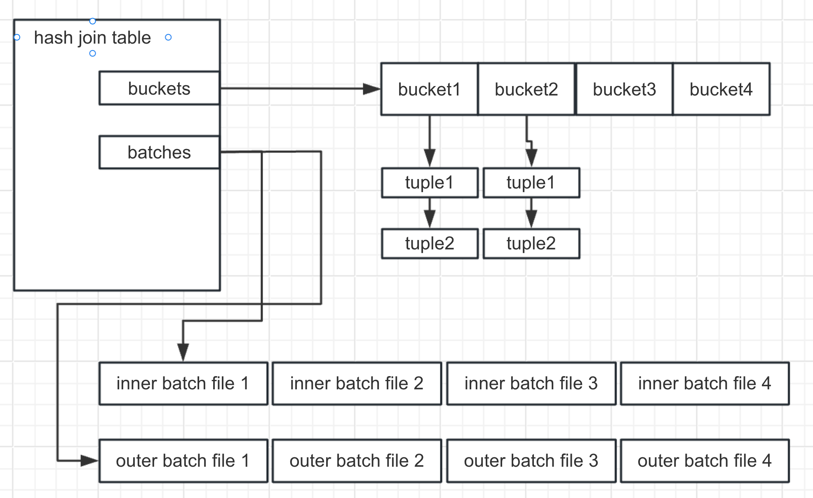

Different from a general hash table which aims to support search, insert, delete and update, the `hash join table` aims to manage a hash join. Reference [hashjoin](hashjoin.md) for what is special for a hash join and we conclude the below ones:
1. During the process of one hash join, `nbatches` hash tables can be built. So a hash join table must store the reference of future hash table data besides the current hash table tuples.
2. During scanning the inner table, we may be aware that the `nbatches` estimated at the previous hash table initialization state are much smaller(since the parameters are passed by planner which estimates them through statistics). 
	1. So `hash join table` needs to expand the `nbatches`. It similar to general hash table expanding its `nbucktes`.
	2. To judge whether it's time to expand the `nbatches`, besides comparing the `ntuples` in current memory table, thinking of the limit of `work_mem` is also important.
3. `data skew` is a headache, `hash join table` needs to be aware that if it really happens.

To complete the first two goal, the skeleton of `hash join table` is shown below

