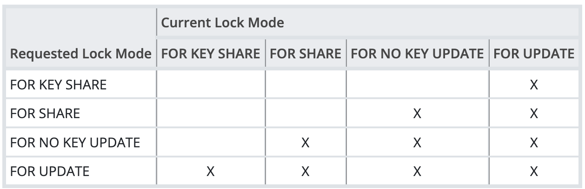

## Background
* Why is `multi-transaction-log`
	* Since many transactions can have the shared lock on a same tuple simultaneously but there is no space to record these transactions in the tuple header, we'd better to manage a specific **shared space** to recording the transactions that holding the tuple-level locks.
	* A shared memory space doesn't seem OK since one transaction can access tons of tuple which is unadvisable to store them in memory. So the only solution is recording in disk
	* So locking a row might cause a disk write
* What kind of locks:
	* From [Official Docs](https://www.postgresql.org/docs/current/explicit-locking.html#LOCKING-ROWS) , PG has four kinds of tuple-level locks.
	* 
	* `FOR UPDATE` : acquired by `delete` or `UPDATE` that modifies the values of certain columns
		* have a **unique index** on them that can be used in a foreign key
	* `FOR NO KEY UPDATE`: acquired by or `UPDATE` that expect the situation above
	* `FOR SHARE` : #TODO
	* `FOR KEY SHARE` : #TODO 

#TODO  let's see `heapam` first before studying the `multixact`
## Low level Design
```
heapam_tuple_delete
.   heapam_tuple_lock_internal
.       heap_lock_tuple
.           if (infomask & HEAP_XMAX_IS_MULTI)
                GetMultiXactIdMembers
		
```