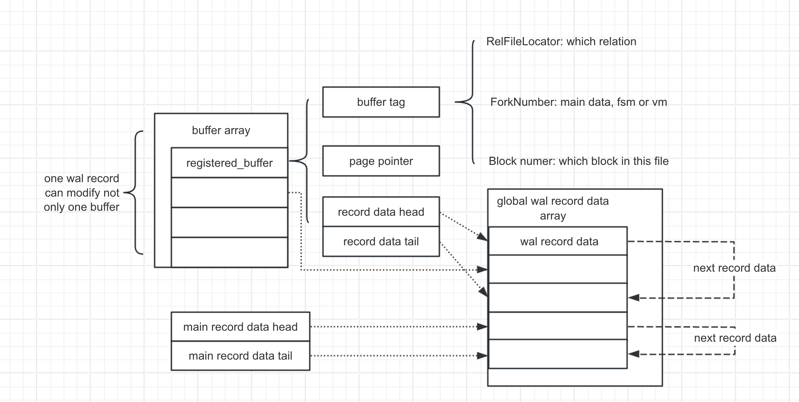

## high level glance

## XLogRegisterBuffer
* just mark a buffer
```
XLogRegisterBuffer
    regbuf = &registered_buffers[block_id];
    BufferGetTag(buffer, &regbuf->rlocator, &regbuf->forkno, regbuf->block);
    regbuf->page = BufferGetPage(buffer);
    regbuf->flags = flags;
    regbuf->rdata_tail = (XLogRecData *) &regbuf->rdata_head;
    regbuf->rdata_len = 0;
```
## XLogRegisterBlock
* Like `XLogRegisterBuffer` , but for registering ablock that's not in the shared buffer pool
* just pass the value we need from parameters
```
void
XLogRegisterBlock(uint8 block_id, RelFileLocator *rlocator, ForkNumberforknum,
                  BlockNumber blknum, Page page, uint8 flags)
```
## XLogRegisterData
* add record to the main chunk
```
XLogRegisterData
    rdata = &rdatas[num_rdatas++];
    rdata->data = data;
    rdata->len = len;

    mainrdata_last->next = rdata;
    mainrdata_last = rdata;
    mainrdata_len += len;
```
## XLogRegisterBufData
* like `XLogRegisterData` but register with thespecific buffer
```
XLogRegisterBufData
    regbuf = &registered_buffers[block_id];
    rdata = &rdatas[num_rdatas++];

    rdata->data = data;
    rdata->len = len;

    regbuf->rdata_tail->next = rdata;
    regbuf->rdata_tail = rdata;
    regbuf->rdata_len += len;
```

## 具体的插入方式
上述代码中的`XLogRecordAssemble`和`XLogInsertRecord`已经概括了具体的插入步骤
### XLogRecordAssemble
> Assemble a WAL record from the registered data and buffers into an XLogRecData chain
```C
static XLogRecData *
XLogRecordAssemble(RmgrId rmid, uint8 info,
                   XLogRecPtr RedoRecPtr, bool doPageWrites,
                   XLogRecPtr *fpw_lsn, int *num_fpi)
{
    for (block_id = 0; block_id < max_registered_block_id; block_id++)
    {
        if (needs_data)
        {
            rdt_datas_last->next = regbuf->rdata_head;
        }
    }
}
```
