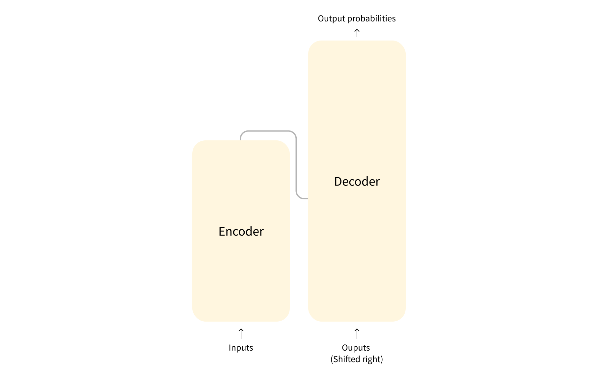
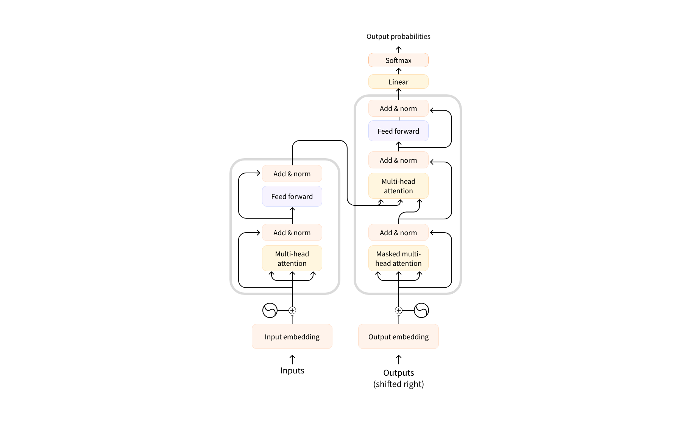

**Self-supervised** learning is a type of training in which the objective is automatically computed from the inputs of the model. That means that humans are not needed to label the data!


## Transfer Learning
*Pretraining*  *Fine-tuning*

```
raw data
\__ pretraining --> [pretrained model]
    \__ Fine-tuning with dataset specific to your task --> [models for your task]
```

## General Transformer architecture


## encoder and decoder

- **Encoder**: receives raw input and returns its feature
- **Decoder**: receives what is output before and generate new outputs




## Attention layers

for now, all you need to know is that this layer will tell the model to **pay specific attention to certain words in the sentence you passed it** (and more or less ignore the others) when dealing with the representation of each word.

## The original architecture

The Transformer architecture was originally designed for translation. During training, the encoder receives inputs (sentences) in a certain language, while the decoder receives the same sentences in the desired target language. In the encoder, the attention layers can **use all the words** in a sentence (since, as we just saw, the translation of a given word can be dependent on what is after as well as before it in the sentence). The decoder, however, works sequentially and can only pay attention to the words in the sentence that **it has already translated** (so, only the words before the word currently being generated). For example, when we have predicted the first three words of the translated target, we give them to the decoder which then uses all the inputs of the encoder to try to predict the fourth word.

