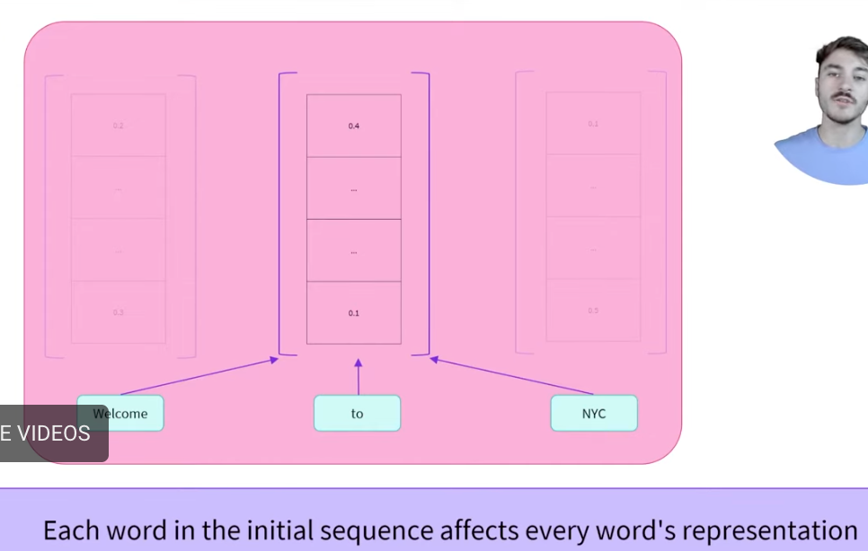
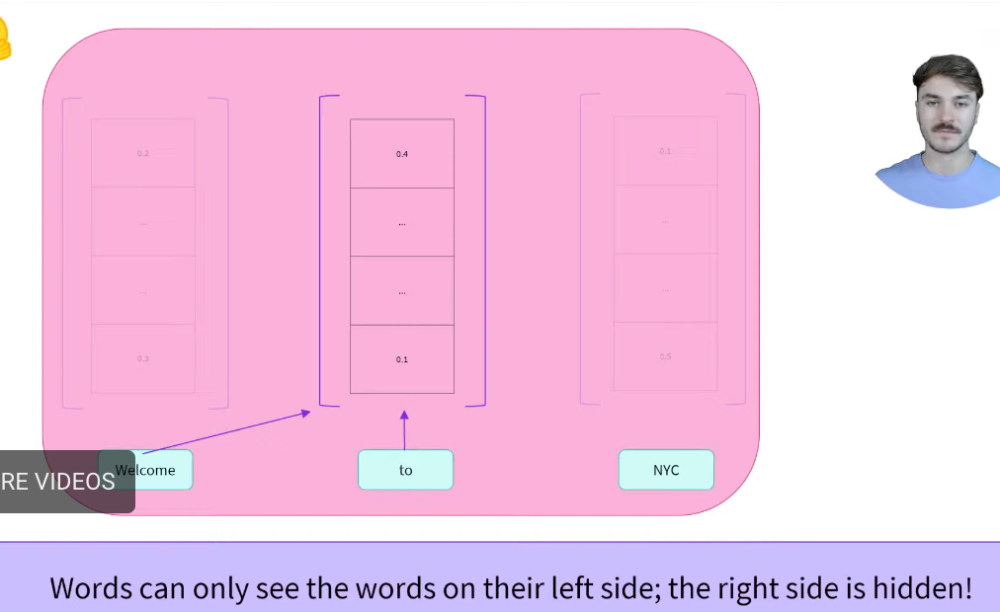
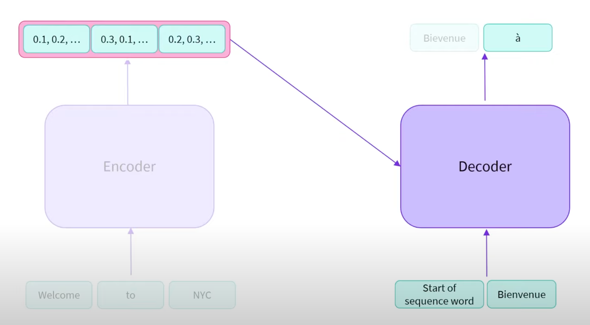

encoder:

masked self-attention


decoder:


encoder-decoder


> Standard attention mechanisms have a computational complexity of O(n²), where n is the sequence length. This becomes problematic for very long sequences. The specialized attention mechanisms below help address this limitation.


## key concepts in transformer
Here is a comprehensive summary of how Transformers handle information, the role of LSH, and where the industry stands today.

---

# The Transformer Playbook: QKV, LSH, and Next-Word Magic

### 1. What are Q, K, and V?

Think of **Self-Attention** as a sophisticated search engine. Every word in your input sentence is transformed into three different roles:

* **Query (Q):** What I am looking for. (e.g., "I am a subject, I need my verb.")
* **Key (K):** What I offer. (e.g., "I am a verb, I might be what you need.")
* **Value (V):** The actual information I carry. (e.g., "The meaning of 'sitting'.")

**The Short Example:**
Sentence: *"The **cat** **sat**"*

* When the model processes **"sat"**, it creates a **Query** () that asks: *"Who did the sitting?"*
* It checks the **Keys** of "The" and "cat".
* The **Key** for **"cat"** () matches the Query perfectly.
* The model then pulls the **Value** of **"cat"** () to understand the context: *An animal is performing the action.*

---

### 2. How to generate the next word?

Generation is a recursive "loop" that follows these steps:

1. **Vectorize:** The input "The cat sat" is converted into numbers (embeddings).
2. **Attend:** The most recent word ("sat") looks at all previous words using the **QKV** mechanism to build a "Context Vector."
3. **Predict:** This Context Vector is slammed against the model's entire vocabulary (e.g., 50,000 words).
4. **Softmax:** The model assigns a probability to every word.
* *on (0.85), mat (0.10), car (0.01)...*


5. **Sample:** The word **"on"** is chosen.
6. **Repeat:** The new input becomes "The cat sat on," and the loop starts again.

```ascii
[Input: "The cat sat"] 
      |
      v
[ Transformer Blocks ] <--- QKV Attention happens here!
      |
      v
[ Probability Map ] -> "on" (85%)
      |
      +----[ New Input: "The cat sat on" ]----> (Repeat)

```

---

### 3. LSH: The Efficiency Shortcut

**LSH (Locality Sensitive Hashing)** lives inside the **Attention stage**.

**The Problem:** In standard attention, every word must look at *every* other word (). If you have 10,000 words, that’s 100 million comparisons!

**How LSH fixes it:**
Instead of a "brute-force" search, LSH sorts  and  into **buckets**.

* It uses a hash function that puts similar vectors into the same bucket.
* **The Shortcut:** A Query () only calculates attention with Keys () in its **own bucket**.

```ascii
Standard Attention:          LSH Attention (Bucketed):
[q] -> [k1, k2, k3, k4]     [Bucket A]  [Bucket B]
      (All checked)         [q, k1, k3]  [k2, k4]
                             (Only k1, k3 checked)

```

By only looking at "neighbors" in the same bucket, the complexity drops from **quadratic** to **near-linear**, allowing the model to read entire books at once.

---

### 4. Is LSH still popular?

In 2026, the status of LSH is split:

* **In LLMs (Training/Inference):** **No.** It has largely been replaced by **FlashAttention**.
* **Why?** LSH is "stochastic" (random). Sometimes it misses relevant words. **FlashAttention** is an engineering masterpiece that makes *exact* attention just as fast as LSH without losing accuracy.


* **In Vector Databases & RAG:** **Yes!**
* **Why?** When you need to search through 10 billion documents in a millisecond (like Google or Pinterest), LSH remains a top-tier algorithm for "Approximate Nearest Neighbor" search.


**The Current "King":**
If you are building a modern LLM (like Llama 3 or GPT-4), the "popular method" is **FlashAttention-2** or **FlashAttention-3**. It uses "tiling" to manage GPU memory so efficiently that the  bottleneck is no longer the biggest problem.

