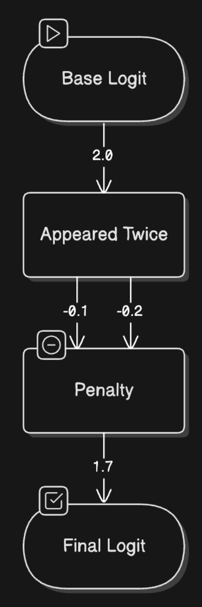
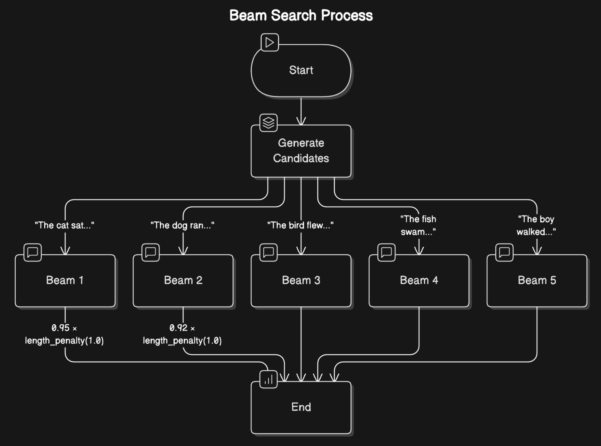
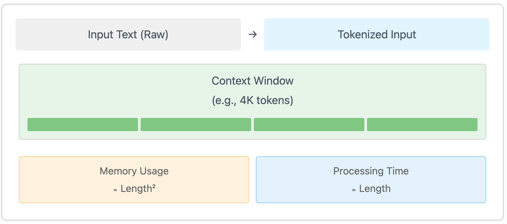
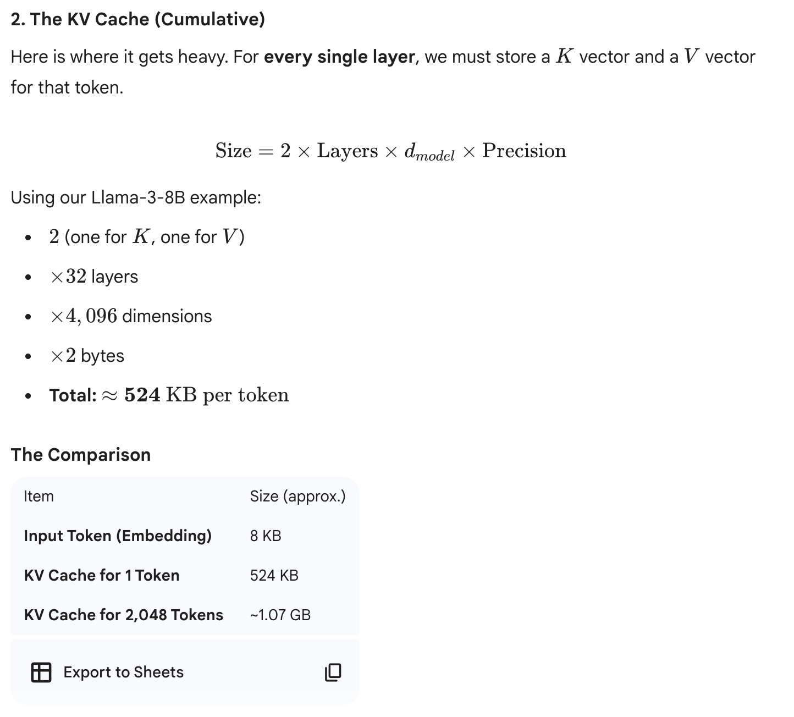

### The Two-Phase Inference Process

prefill and decode

prefill
* Tokenization: input text into tokens
* Embedding Conversion: tokens into numerical representations
* Initial Processing: Running these embeddings through the model’s neural networks

Think of it as reading and understanding an entire paragraph before starting to write a response.

Decode Phase
* Attention Computation: look back
* Probability Calculation:
* Token Selection:
* Continuation Check

### From Probabilities to Token Choices
Raw Logits --> Temperature Control --> Top-p (Nucleus) Sampling / Top-k Filtering:
> Logits 是深度学习模型（特别是分类模型）在最后一层（通常是全连接层）输出的原始、未归一化分数。它们介于 \(-\infty \) 到 \(+\infty \) 之间，代表模型对各个类别的置信度或偏好，需通过 Softmax 或 Sigmoid 函数转换成概率

### Managing Repetition: Keeping Output Fresh

LLMs tend to repeat themselves --> two types of penalties:
* Presence Penalty: applied to any token that has appeared before
* Frequency Penalty: how often a token has been used

> Seems like the startup cost and running cost

### Controlling Generation Length: Setting Boundaries

* Token Limits: Hard limit
* Stop Sequences: patterns that signal the end of generation
* End-of-Sequence Detection: Letting the model naturally conclude its response

> use “\n\n” as a stop sequence while writing a single paragraph

###  Beam Search: Looking Ahead for Better Coherence

it explores multiple possible paths simultaneously - like a chess player thinking several moves ahead. 

It's NOT widely used now.

## pratical challenge

### critical metrics

- **Time to First Token (TTFT)**
- **Time Per Output Token (TPOT)**
- **Throughput**: How many requests can you handle simultaneously?
- **VRAM Usage**: How much GPU memory do you need?

### The Context Length Challenge

substantial costs with long context:

- **Memory Usage**: Grows quadratically with context length
- **Processing Speed**: Decreases linearly with longer contexts
- **Resource Allocation**: Requires careful balancing of VRAM usage

### The KV Cache Optimization

