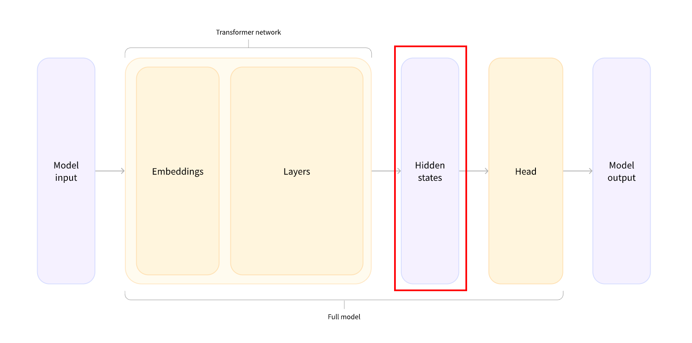

## Going through the model

the different tasks could have been performed with the same architecture, but each of these tasks will have a different head associated with it.




Full example

```python
from transformers import AutoTokenizer
from transformers import AutoModel
from transformers import AutoModelForSequenceClassification

# 1. raw text to tokens
checkpoint = "distilbert-base-uncased-finetuned-sst-2-english"
tokenizer = AutoTokenizer.from_pretrained(checkpoint)
raw_inputs = [
    "I've been waiting for a HuggingFace course my whole life.",
    "I hate this so much!",
]
inputs = tokenizer(raw_inputs, padding=True, truncation=True, return_tensors="pt")
print(inputs)

# 2. compute by the model
checkpoint = "distilbert-base-uncased-finetuned-sst-2-english"
model = AutoModel.from_pretrained(checkpoint)
outputs = model(**inputs)
print(outputs.last_hidden_state.shape)

# 3. the classifier head
checkpoint = "distilbert-base-uncased-finetuned-sst-2-english"
model = AutoModelForSequenceClassification.from_pretrained(checkpoint)
outputs = model(**inputs)
print(outputs.logits.shape)
predictions = torch.nn.functional.softmax(outputs.logits, dim=-1)
print(predictions)

```

### Preprocessing with a tokenizer

output of the tokenizer

```bash
{
    'input_ids': tensor([
        [  101,  1045,  1005,  2310,  2042,  3403,  2005,  1037, 17662, 12172, 2607,  2026,  2878,  2166,  1012,   102],
        [  101,  1045,  5223,  2023,  2061,  2172,   999,   102,     0,     0,     0,     0,     0,     0,     0,     0]
    ]), 
    'attention_mask': tensor([
        [1, 1, 1, 1, 1, 1, 1, 1, 1, 1, 1, 1, 1, 1, 1, 1],
        [1, 1, 1, 1, 1, 1, 1, 1, 0, 0, 0, 0, 0, 0, 0, 0]
    ])
}
```

### model and its hidden states

vector output by the Transformer module, three dimensions:

1. **Batch size**: The number of sequences processed at a time  (2 in our example).
2. **Sequence length**: The length of the numerical representation of the sequence   (16 in our example).
3. **Hidden size**: The vector dimension of each model input. (can be very large)

output

```
torch.Size([2, 16, 768])
```

It represents a **3D Tensor**.

- **`2` (Batch Size):** You called it "sentences," and that’s a great way to think of it. More technically, it’s the number of **independent sequences** being processed at the exact same time. This is how GPUs stay busy—by doing the math for both sequences in parallel.

- **`16` (Sequence Length / $L$):** You called it "words," but in LLM-land, we call them **tokens**. Since tokenizers sometimes split one word into two pieces (like `berry` into `ber` + `ry`), this dimension represents the total number of tokens in each sequence.

- **`768` (Hidden Dimension / $d_{model}$):** You are exactly right—this is the vector size. Every single token is "embedded" into a 768-dimensional space. This is the "Goldilocks" size used by the famous **BERT-base** model.

### Model heads: Making sense out of numbers

The model heads take the high-dimensional vector of hidden states as input and project them **onto a different dimension**. They are usually composed of **one or a few linear layers:**


output

```python
print(outputs.logits.shape)
torch.Size([2, 2])

print(outputs.logits)
tensor([[-1.5607,  1.6123],
        [ 4.1692, -3.3464]], grad_fn=<AddmmBackward>)
```

after the softmax

```
tensor([[4.0195e-02, 9.5980e-01],
        [9.9946e-01, 5.4418e-04]], grad_fn=<SoftmaxBackward0>)
```

Python

```
import torch

input_tensor = torch.tensor([[-1.5607, 1.6123],
                             [4.1692, -3.3464]])

softmax_out = torch.softmax(input_tensor, dim=-1)
exp_tensor = torch.exp(input_tensor)
sum_exp = exp_tensor.sum(dim=-1, keepdim=True)

print(f"Input:\n{input_tensor}")
print(f"Exp:\n{exp_tensor}")
print(f"Sum Exp:\n{sum_exp}")
print(f"Softmax Output:\n{softmax_out}")
```

Code output


```
Input:
tensor([[-1.5607,  1.6123],
        [ 4.1692, -3.3464]])
Exp:
tensor([[2.0999e-01, 5.0143e+00],
        [6.4664e+01, 3.5211e-02]])
Sum Exp:
tensor([[ 5.2243],
        [64.6989]])
Softmax Output:
tensor([[4.0195e-02, 9.5981e-01],
        [9.9946e-01, 5.4423e-04]])
```

This transformation is the "Normalization" phase of the Attention mechanism. In an LLM, Softmax is used to turn raw "scores" (logits) into **probabilities** that sum up to 1 (or 100%).

#### softmax

For a vector of scores $z$, the Softmax for each element $i$ is calculated as:

$$\sigma(z)_i = \frac{e^{z_i}}{\sum_{j=1}^{K} e^{z_j}}$$

Where:

* $e$ is Euler's number ($\approx 2.718$).
* The numerator is the **exponential** of the specific score.
* The denominator is the **sum of exponentials** of all scores in that row.

Step-by-Step Calculation

Let's look at how your specific numbers were transformed row by row (using `dim=-1`).

Row 1: $[-1.5607, 1.6123]$

1. **Calculate Exponentials ($e^z$):**
   * $e^{-1.5607} \approx 0.20999$
   * $e^{1.6123} \approx 5.0143$
2. **Calculate the Sum:**
   * $Sum = 0.20999 + 5.0143 = \mathbf{5.2243}$
3. **Divide by Sum:**
   * $0.20999 / 5.2243 = \mathbf{0.040195}$ (which is $4.0195 \times 10^{-2}$)
   * $5.0143 / 5.2243 = \mathbf{0.95981}$
   * *Result:* $[0.0402, 0.9598]$ (Sums to 1.0)

Row 2: $[4.1692, -3.3464]$

1. **Calculate Exponentials ($e^z$):**
   * $e^{4.1692} \approx 64.664$
   * $e^{-3.3464} \approx 0.0352$
2. **Calculate the Sum:**
   * $Sum = 64.664 + 0.0352 = \mathbf{64.6992}$
3. **Divide by Sum:**
   * $64.664 / 64.6992 = \mathbf{0.99946}$
   * $0.0352 / 64.6992 = \mathbf{0.000544}$ (which is $5.4418 \times 10^{-4}$)
   * *Result:* $[0.9995, 0.0005]$ (Sums to 1.0)