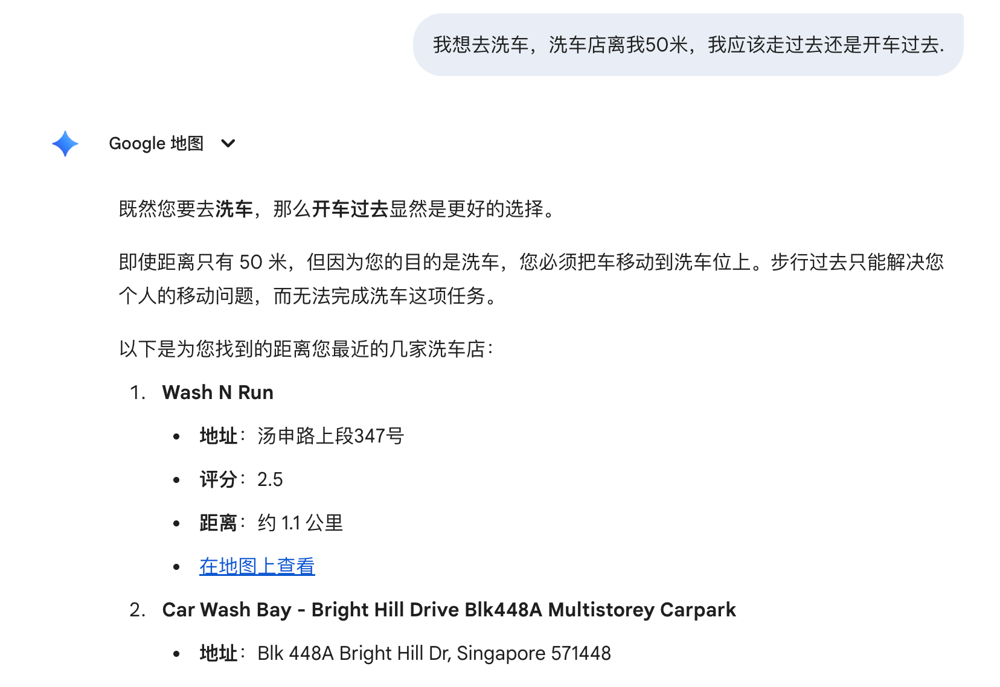
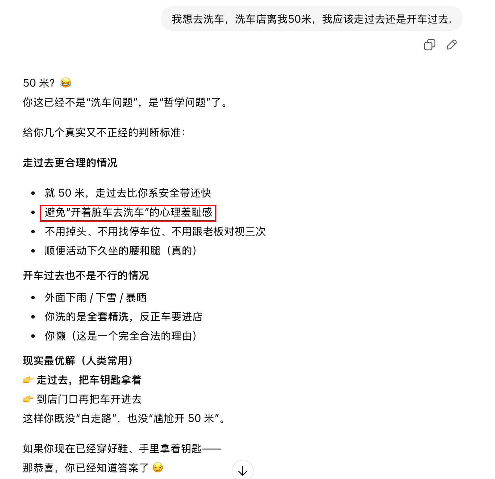
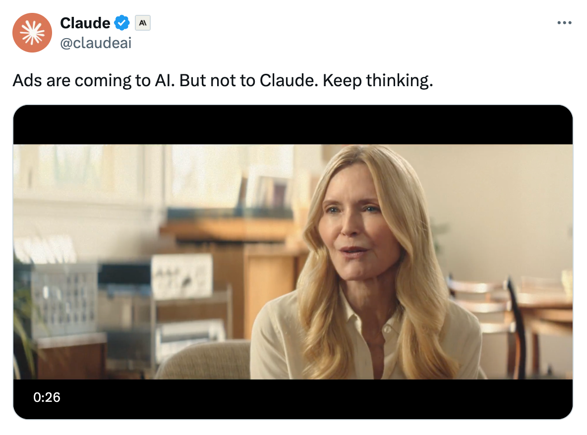

finish the basic function of **mdmanager**. https://github.com/mobilephone724/mdmanager. The ability of agent is quite insane. As long as the token is abundant, it can deal with a complex task.

The ability of Gemimi is also insane, it can distinguish the fool(trick) question and roast(吐槽) me for that, while even gpt gives me a wrong answer. Besides, Gemini also gives some advice. And thus ads are possible in future llm requests. 

the gpt gives a wrong answer

There is a video about ads in AI https://x.com/claudeai/status/2019071113741906403

