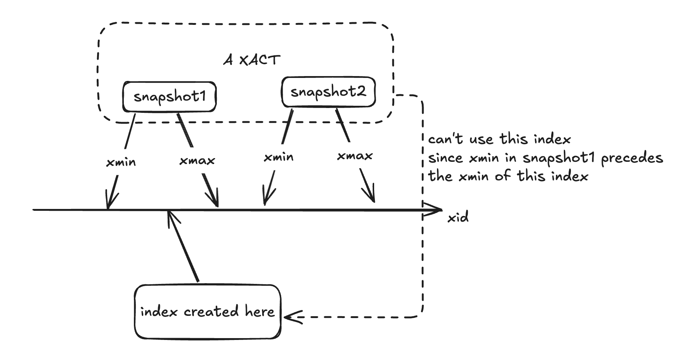
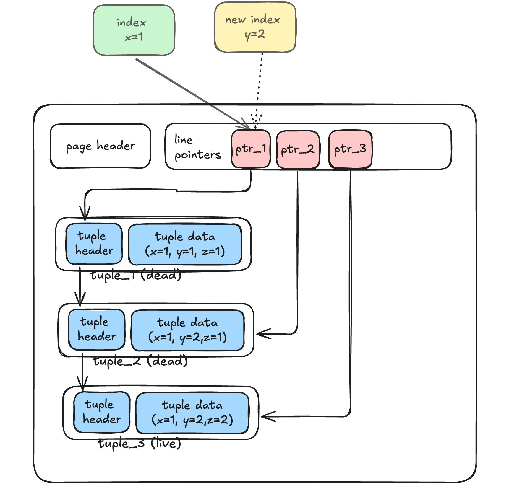
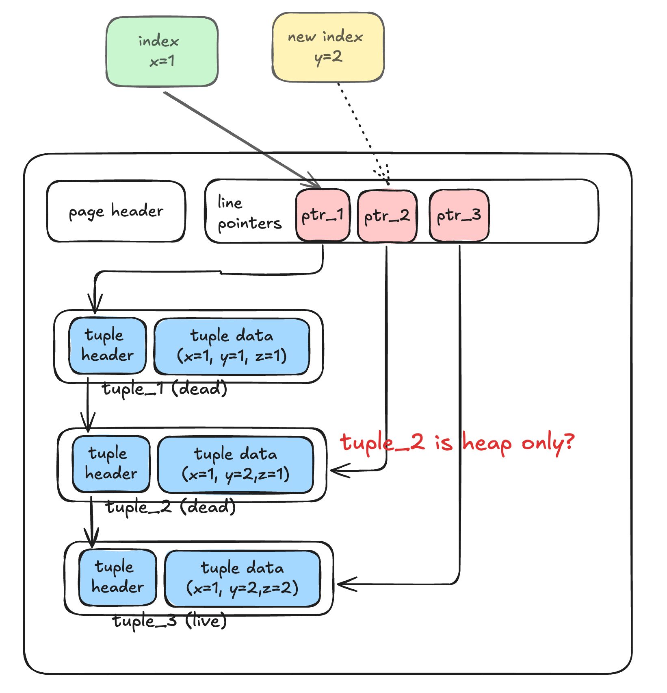

## 0 概述

本文介绍普通的创建索引的大致过程（或者说 access method 对应的框架），包括从入口函数，到进入对应的 `access method` 的过程。不包括 `access method` 的内部实现。分区表，表达式索引等非主要特性这里省略。

## 1 准备步骤

1. 权限校验：包括
2. 选择索引名， access method （主要是确认 access method 是否存在）
3. 加锁：shared lock，阻止写入

## 2 创建空索引

1. 创建 heap `heap_create`
   1. build relcache
   2. 创建文件 `smgrcreate`
   3. 记录依赖
2. 向 `pg_class` , `pg_index` , `pg_attribute`  中写入对应的记录
3. 注册对应表的缓存无效信息，会在事务结束时发送 `CacheInvalidateRelcache`

## 3 调用对应的 index access method 创建索引

这里和 HOT 关系较大，需要简单展开：

在 index access method 内部，会使用回调函数 `heapam_index_build_range_scan` 来扫描 heap，以确定有哪些 tuple 需要被创建索引。

1. 此时使用的快照为 `SnapshotAny` ，即所有行都可见。
2. 每当扫描到一个 `tuple` 时，像执行 vacuum 一样判断该 tuple 是否能被 vacuum。有一个 `tuple` 
   1. 对所有事务都不可见 `HEAPTUPLE_DEAD`，那么显然不需要对他创建索引
   2. 如果所有事务都可见 `HEAPTUPLE_LIVE`，那么显然需要对他创建索引
   3. 如果一些事务可见：
      1. `HEAPTUPLE_RECENTLY_DEAD` 被删除了，但是有些事务仍然可以看到？？？
      2. `INSERT_IN_PROGRESS` 和 `DELETE_IN_PROGRESS` ：考虑到大部分情况下 `create index` 语句不会在事务块中执行，这里跳过。

---

### 3-1 如何处理 `HEAPTUPLE_RECENTLY_DEAD`

#### 3-1-1 非 HOT

说明该 tuple 被删除了，但是有一些事务仍然对其可见，那么也需要加入到索引中。否则这些事务后续通过当前创建的索引就无法找到该元组。

注意：在判断一个表有哪些索引时，使用快照是“最新的快照”，而非当前事务的快照。

#### 3-1-2 HOT

如果该 tuple 在 HOT 链中，问题就有些棘手。

1. 此时不方便将 HOT 链破坏掉。（创建索引的时候直接修改 HEAP 中内容确实不算合理）
2. 但如果不破坏，就（必须）将该 tuple 加入到新索引中，而该 HOT 链可能和新索引冲突

为此，PostgreSQL 采取了一种巧妙地方式

1. 不将该 tuple 加入到新索引中
2. 对于一些仍然可以访问该 tuple 的事务，阻止其使用新索引。

组织的方式为：pg_index 中有字段 `indcheckxmin` 。当该字段为 true 时，如果有事务像用该索引，需要确保自己的 `TransactionXmin` （逻辑）大于 `pg_index`  中对应 tuple 的 `xmin` 

1. `TransactionXmin` 表示当前事务的所有快照中，最小的的 xmin。（快照中， `xmin` 前的事务都结束了）
2. `pg_index`  中对应 tuple 的 `xmin` 表示 该索引创建的 xid

### 3-2 对 HOT 链上的元组构建索引

由于创建新索引会导致已有的 HOT 链无效，这里还需讨论如何将已有 HOT 链中元组如何构建到索引中。考虑如下情形，现在需要对 `y` 这一列创建索引，只需要将 tuple_3 加入到索引中(y=2)即可。由于一个 line pointer 只能在一个 HOT 链中，所以此时索引应该指向 lp_1（注意 tuple_1 有 y=1)。

如果想去“优化“ 新HOT链的长度，让索引指向 lp_2 或者 lp_3，会产生很多问题，例如指向 lp_2，那么此时 tuple_2 还是 heap only tuple 么？

