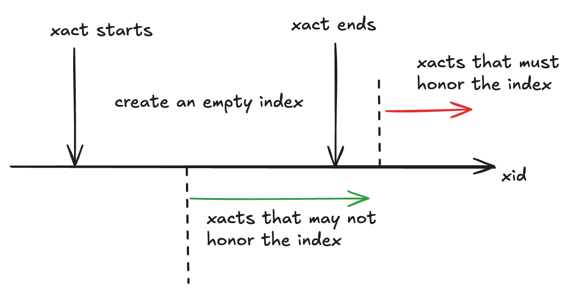
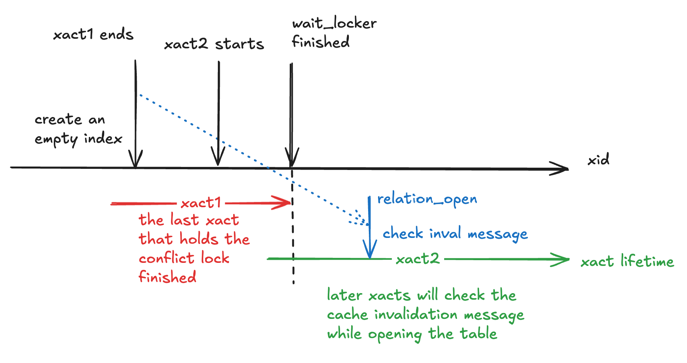
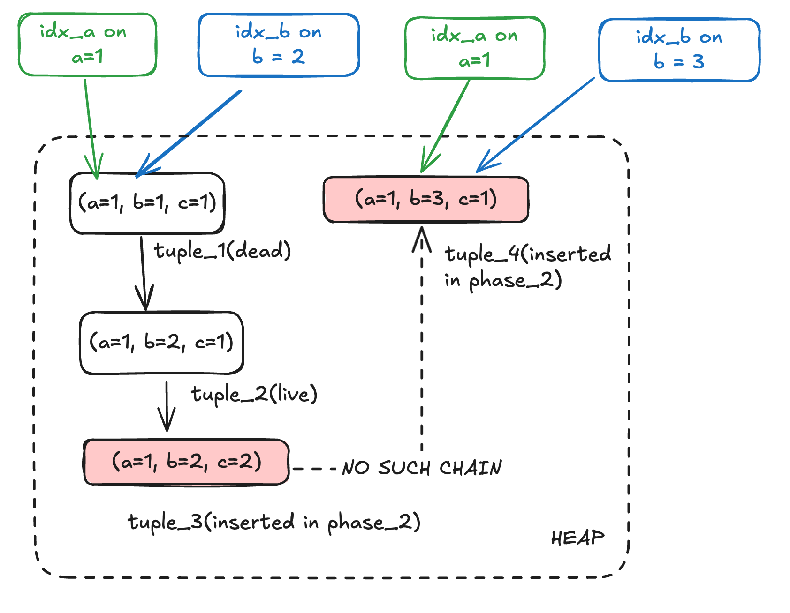
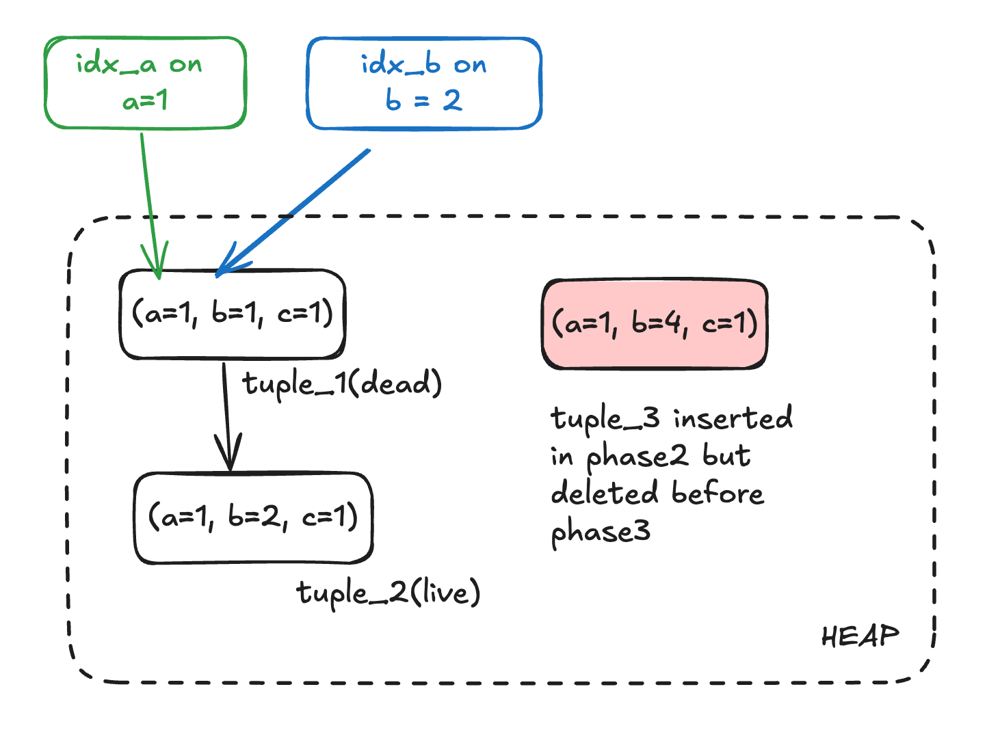
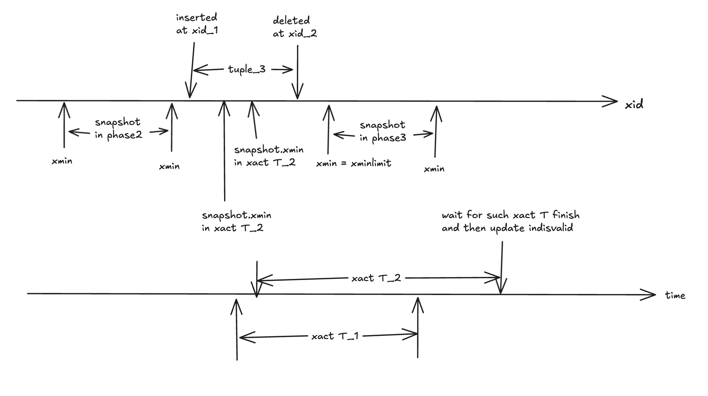

## 概述
* 解决的问题：
  * 同步创建索引 `create index concurrently` 解决了创建索引期间，如何不阻塞正常执行 `DML` 的问题。
* 思路：
  * 和 `pg_repack` , `pg_squeeze` 等重写表的工具相似，内核中实现的同步创建索引也使用了 “存量 + 增量” 的方式。
  * 不同的是，官方提供的同步创建索引功能，几乎没有和任何其他特性耦合，例如没有使用触发器和逻辑复制。


难点有：
1. 在不同的字段上，新创建一个索引会破坏 `heap` 中的原 `HOT` 链，创建的过程中也会影响到新的 `HOT` 链。
2. 在不使用触发器和逻辑复制等功能的情况下，如何记录增量数据？


简单流程：通过三个事务完成

1. 事务一：创建索引文件和修改系统表。 此时索引为 `not read` + `not valid`。但其他 SQL 需要遵循对应的 HOT 规则。
2. 事务二：获取快照 `A` ，使用对该快照可见的元组创建索引。事务二结束后，其他 SQL 修改表时，也需要修改对应的索引。
3. 事务三：获取快照 `B` ，将快照 `B` 可见但快照 `A` 不可见的元组插入索引

## 阶段一：创建空索引

创建空索引的核心原因是：在将存量数据加入的索引中时，确保其他连接的修改不会破坏 HOT（更近一步的原因在阶段 2 描述）。方式为向 pg_index 中记录一个 `indisready==false && indisvalid==false` 的索引。所以问题在于：其他连接如何感知到该索引。

每个连接都会缓存自己 `relcache` 和 `syscache` ，如果没有收到失效信息，这些缓存会一直保留。一般而言，事务开始时，会处理所有的缓存失效消息，在事务的执行的过程中，也有埋点来处理失效信息。但是处理结果不会返回给发送端。



所以为了保证其他连接都会看到新索引，在创建空索引的事务结束后，需要等到当前所有其他事务全部结束，才能开启第二阶段

---

代码实现与上述有所差别：

“等待其他事务” 并不是通过巡检 `ProcArray` 等方式实现，而是巧妙的使用了 `lmgr` 层的 `WaitForLockers` 实现：即等到没有连接持有该表的与 `ShareLock` 相冲突的锁：

```C
/*
 * Now we must wait until no running transaction could have the table open
 * with the old list of indexes.  Use ShareLock to consider running
 * transactions that hold locks that permit writing to the table.  Note we
 * do not need to worry about xacts that open the table for writing after
 * this point; they will see the new index when they open it.
 */
WaitForLockers(heaplocktag, ShareLock, true);
```

（1）`SharedLock`  与 `select` 和 `select for update/share` 相冲突，持有者两种锁时，都无法破坏 HOT 链。（2）当进程执行修改表的操作时，已经需要打开表获取 `relcache` ，而在打开表操作时，会处理缓存失效信息。

```
relation_open/try_relation_open -> LockRelationOid -> AcceptInvalidationMessages
```



## 阶段二：使用存量数据创建索引

在确保所有连接都发现了该索引时，可以使用存量数据创建索引

该过程和普通的创建索引相似，但是进行 `heap` 扫描时，使用的快照不同。在一般的索引创建中，使用的是 `SnapshotAny` ，所有行都可见，而 CIC 中使用的是当前事务的快照。

问题仍然出现在 HOT 链上，虽然对于创建索引的字段，当前不会产生新的 HOT 链，但是仍然会有旧的 HOT 链 ，所以构建索引的方式和普通地创建索引相同。

举个例子:

- 初始状态有 tuple_1 和 tuple_2 ，以及字段 a 上的索引。现对字段 b 创建建索引，
- tuple_1 对当前快照不可见（too old）
- tuple_2 可见。当把 tuple_2 加入到索引中时，索引值为 b=2，但索引入口指向 b=1 的元组（HOT链的开头），
- 在阶段2中，有其他事务将 tuple_2 进行成了 tuple_3 ，将 c 改为了 2。该更新满足 HOT （a, b 都没有变），所以仍在 HOT 链上。但是 tuple_3 对当前快照（CIC）不可见 (in feature)，所以不处理。
- 在阶段2中，有其他事务将 tuple_3 进行成了 tuple_4，将 b 改为了3。该更新不满足 HOT，所以索引 idx_a 需要创建新的指针


当索引构建完毕后，将 pg_index 的中对应行的 `indisready` 设置为 true，这样其他事务后续修改表时，会同步修改该索引。和阶段1相似，当前事务提交后，开启新的事物（xact3），等到其他事务都感知到 `indisready=true` 时（同样使用 WaitForLockers 方案），开始阶段三。

## 阶段三： 增量数据的插入

该步骤的主要工作为把阶段二中遗漏的 tuple 加入索引中。方法为：使用当前的事务快照，将该快照可见的但是索引中没有的元组，加入索引中，具体做法为：

（一）扫描索引，获取索引中所有的 ctid，并进行排序，得到 `Tuplesortstate`

（二）使用当前快照，进行全表扫描，对于每一行，在 `Tuplesortstate` 搜索对应的 ctid。注意，如果是 heap only tuple，则使用其根 tuple 的 ctid。如果在 `Tuplesortstate` 中没有找打，则向索引中插入对应的指针。

举个例子： tuple_3 虽然是在阶段二中新增的 tuple ，但是其根 tuple，即 tuple_1 已经在索引中了，所以在阶段三中忽略。而 tuple_3 不在 HOT 链中，所以需要插入到元组中。



增量数据插入结束后，仍不能设置 `indisvalid=true` ：考虑一个元组，它在阶段二中被创建，却在阶段三前被删除，所以此时它仍然不在索引中，但是可能有其他事务（事务 T）可以看到该元组；如果此时修改 `indisvalid=true` 并提交，那么事务 T 使用该索引时，就无法获取到该元组 。故此时需要等事务 T 结束。：




所以流程为将增量数据插入元组后，获取当前快照的 xmin，记为 xminlimit，并提交。之后开启新的事物，等待所有含有 `snap.xmin<xminlimit` 的快照的事务全部提交，再设置 `indisvalid=true` 并提交。




提交后，所以事务（包括正在运行的）都可以使用新索引了。


## FAQ

### 1 为什么需要保证阶段二中：其他连接的修改不会破坏 HOT


## draft

### Official document

https://www.postgresql.org/docs/current/sql-createindex.html

>  Creating an index can interfere with regular operation of a database. Normally PostgreSQL locks the table to be indexed against writes and performs the entire index build with a single scan of the table. Other transactions can still read the table, but if they try to insert, update, or delete rows in the table they will block until the index build is finished. This could have a severe effect if the system is a live production database. Very large tables can take many hours to be indexed, and even for smaller tables, an index build can lock out writers for periods that are unacceptably long for a production system.
>
>  PostgreSQL supports building indexes without locking out writes. This method is invoked by specifying the `CONCURRENTLY` option of `CREATE INDEX`. When this option is used, PostgreSQL must perform two scans of the table, and in addition it must wait for all existing transactions that could potentially modify or use the index to terminate. Thus this method requires more total work than a standard index build and takes significantly longer to complete. However, since it allows normal operations to continue while the index is built, this method is useful for adding new indexes in a production environment. Of course, the extra CPU and I/O load imposed by the index creation might slow other operations.
>
>  In a concurrent index build, **the index is actually entered as an “invalid” index into the system catalogs in one transaction, then two table scans occur in two more transactions**. Before each table scan, the index build must wait for existing transactions that have modified the table to terminate. **After the second scan, the index build must wait for any transactions that have a snapshot (see [Chapter 13](https://www.postgresql.org/docs/current/mvcc.html)) predating the second scan to terminate**, including transactions used by any phase of concurrent index builds on other tables, if the indexes involved are partial or have columns that are not simple column references. Then finally the index can be marked “valid” and ready for use, and the `CREATE INDEX` command terminates. Even then, however, the index may not be immediately usable for queries: in the worst case, it cannot be used as long as transactions exist that predate the start of the index build.
>
>  If a problem arises while scanning the table, such as a deadlock or a uniqueness violation in a unique index, the `CREATE INDEX` command will fail but leave behind an “invalid” index. This index will be ignored for querying purposes because it might be incomplete; however it will still consume update overhead. The psql `\\d` command will report such an index as `INVALID`:

### Others’ blog

*  [PostgreSQL create index concurrently原理分析](https://www.notion.so/PostgreSQL-create-index-concurrently-4ebd2ea38bb24324bc0e165e017daea1?pvs=21)
*  https://postgrespro.com/blog/pgsql/3994098
*  https://postgrespro.com/blog/pgsql/4161264

### 核心问题

*  两次快照读的原因
*  怎么“正好只”补充两次快照之间的增量数据？
*  merge 是怎么实现的？

```c
/*
 * validate_index - support code for concurrent index builds
 *
 * We do a concurrent index build by first inserting the catalog entry for the
 * index via index_create(), marking it not indisready and not indisvalid.
 * Then we commit our transaction and start a new one, then we wait for all
 * transactions that could have been modifying the table to terminate.  Now
 * we know that any subsequently-started transactions will see the index and
 * honor its constraints on HOT updates; so while existing HOT-chains might
 * be broken with respect to the index, no currently live tuple will have an
 * incompatible HOT update done to it.  We now build the index normally via
 * index_build(), while holding a weak lock that allows concurrent
 * insert/update/delete.  Also, we index only tuples that are valid
 * as of the start of the scan (see table_index_build_scan), whereas a normal
 * build takes care to include recently-dead tuples.  This is OK because
 * we won't mark the index valid until all transactions that might be able
 * to see those tuples are gone.  The reason for doing that is to avoid
 * bogus unique-index failures due to concurrent UPDATEs (we might see
 * different versions of the same row as being valid when we pass over them,
 * if we used HeapTupleSatisfiesVacuum).  This leaves us with an index that
 * does not contain any tuples added to the table while we built the index.
 *
 * Next, we mark the index "indisready" (but still not "indisvalid") and
 * commit the second transaction and start a third.  Again we wait for all
 * transactions that could have been modifying the table to terminate.  Now
 * we know that any subsequently-started transactions will see the index and
 * insert their new tuples into it.  We then take a new reference snapshot
 * which is passed to validate_index().  Any tuples that are valid according
 * to this snap, but are not in the index, must be added to the index.
 * (Any tuples committed live after the snap will be inserted into the
 * index by their originating transaction.  Any tuples committed dead before
 * the snap need not be indexed, because we will wait out all transactions
 * that might care about them before we mark the index valid.)
 *
 * validate_index() works by first gathering all the TIDs currently in the
 * index, using a bulkdelete callback that just stores the TIDs and doesn't
 * ever say "delete it".  (This should be faster than a plain indexscan;
 * also, not all index AMs support full-index indexscan.)  Then we sort the
 * TIDs, and finally scan the table doing a "merge join" against the TID list
 * to see which tuples are missing from the index.  Thus we will ensure that
 * all tuples valid according to the reference snapshot are in the index.
 *
 * Building a unique index this way is tricky: we might try to insert a
 * tuple that is already dead or is in process of being deleted, and we
 * mustn't have a uniqueness failure against an updated version of the same
 * row.  We could try to check the tuple to see if it's already dead and tell
 * index_insert() not to do the uniqueness check, but that still leaves us
 * with a race condition against an in-progress update.  To handle that,
 * we expect the index AM to recheck liveness of the to-be-inserted tuple
 * before it declares a uniqueness error.
 *
 * After completing validate_index(), we wait until all transactions that
 * were alive at the time of the reference snapshot are gone; this is
 * necessary to be sure there are none left with a transaction snapshot
 * older than the reference (and hence possibly able to see tuples we did
 * not index).  Then we mark the index "indisvalid" and commit.  Subsequent
 * transactions will be able to use it for queries.
 *
 * Doing two full table scans is a brute-force strategy.  We could try to be
 * cleverer, eg storing new tuples in a special area of the table (perhaps
 * making the table append-only by setting use_fsm).  However that would
 * add yet more locking issues.
```

